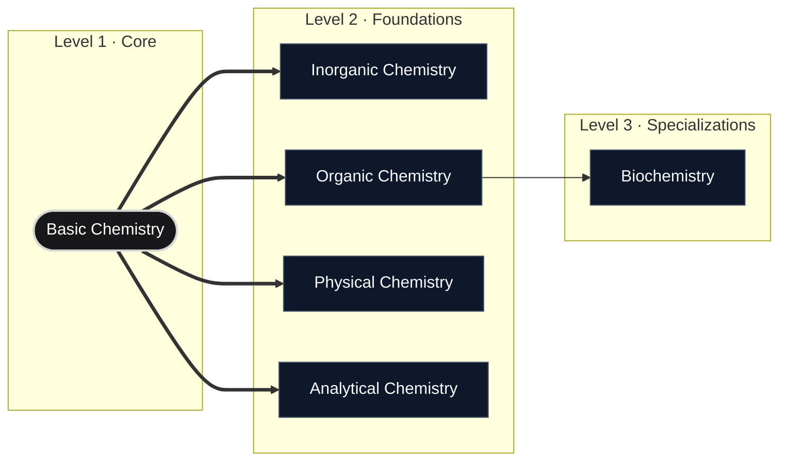

# General Chemistry Domain

> "Nothing in life is to be feared, it is only to be understood. Now is the time to understand more, so that we may fear less." — Marie Curie

## Overview

This domain serves as the primary entry point for the study of chemical science. It organizes core chemical principles into structured learning modules, covering everything from fundamental atomic structure to specialized advanced disciplines.

## Domain Roadmap

## Modules

| Module                                       | Description                                                                    | Level        | Status        |
| :------------------------------------------- | :----------------------------------------------------------------------------- | :----------- | :------------ |
| [Basic Chemistry](basic-chemistry/README.md) | Foundational principles, atomic theory, states of matter, and stoichiometry.   | Beginner     | **Available** |
| Inorganic Chemistry                          | Study of inorganic compounds, transition metals, and coordination chemistry.   | Intermediate | *Planned*     |
| Organic Chemistry                            | Carbon-based chemistry, functional groups, reaction mechanisms, and synthesis. | Intermediate | *Planned*     |
| Physical Chemistry                           | Chemical thermodynamics, kinetics, quantum mechanics, and electrochemistry.    | Advanced     | *Planned*     |
| Analytical Chemistry                         | Qualitative and quantitative analysis methods, titrimetry, and spectrometry.   | Advanced     | *Planned*     |
| Biochemistry                                 | Chemical processes within and relating to living organisms.                    | Advanced     | *Planned*     |

## Prerequisites

* **Mathematics**: Elementary algebra, basic logarithms, and introductory calculus.
* **Physics**: Fundamentals of energy, work, and electrostatics.