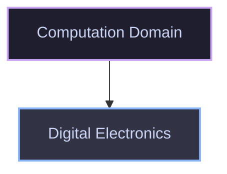

# Computation Domain

The **Computation** domain covers theoretical foundations, processing architecture principles, and the discrete logic interface behind computing systems.

## Domain Structure

## Available Modules

| Module                                                 | Description                                                                           | Status |
| :----------------------------------------------------- | :------------------------------------------------------------------------------------ | :----- |
| [Digital Electronics](./digital-electronics/README.md) | Boolean logic, logic gates, combinational circuits, and digital hardware foundations. | Active |
