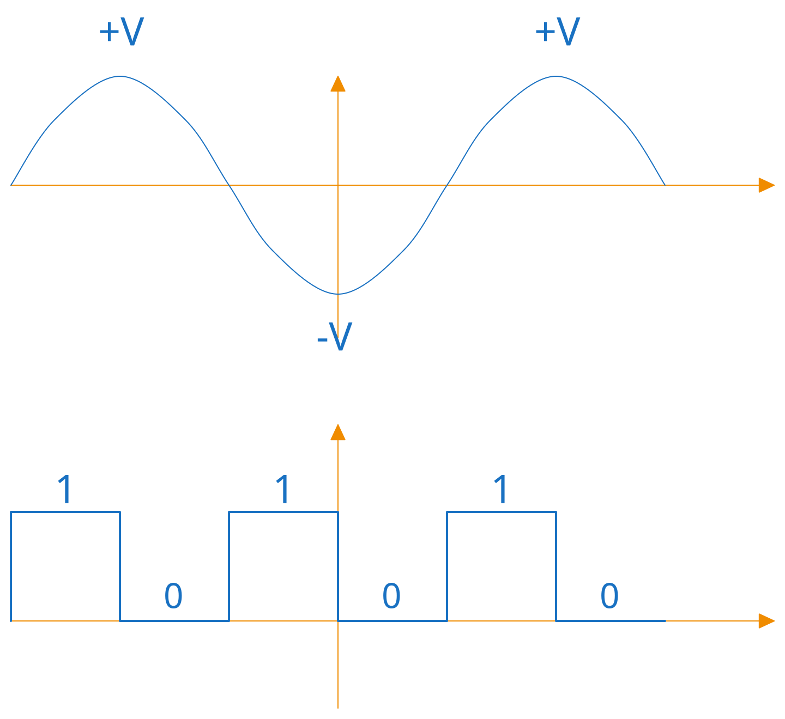

# Introduction to Digital Electronics

Digital electronics is the foundation of modern computing. It focuses on how to represent, process, and store information using discrete electrical signals, in contrast to analog electronics, which deals with continuous quantities.

## Analog vs. Digital Signals

In nature, most physical phenomena occur continuously over time: room temperature, sound pressure, or light intensity. Electrically, an **analog signal** can assume infinitely many voltage values within a range.

The main limitation of analog signals is their vulnerability to noise: any small electrical interference permanently alters the original signal.

In contrast, a **digital signal** is discretized. In a binary system, we abstract voltage variations into just two well-defined states: **$0$** and **$1$** (or *LOW* and *HIGH*).

## Why Digital?

The primary advantage of digital electronics is its **high noise tolerance**.

Since the system only needs to distinguish between two states ($0$ or $1$), it can withstand small voltage fluctuations and interference along the transmission line. As long as the noise remains within the circuit's tolerance limits, the information is correctly interpreted and restored.
This provides:
* **Reliability:** Data processing and transmission without information loss.
* **Reproducibility:** Easy storage and exact copying of data.
* **Abstraction:** Building complex systems (like CPUs) from simple logical blocks.

