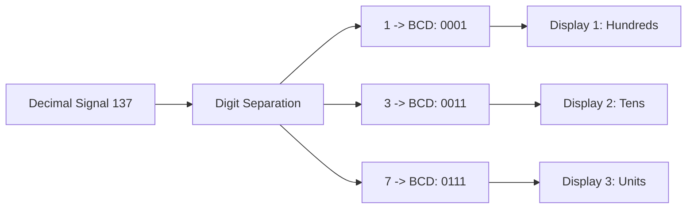

# BCD Code (Binary-Coded Decimal)

Digital systems process data in pure binary, but human interfaces operate in the decimal system. To bridge the logic of computers with digital display units (such as screens and clocks), the BCD (*Binary-Coded Decimal*) code provides a direct mapping between each decimal digit and a fixed group of four bits.

## From Problem to Definition

Converting a large decimal number to pure binary requires successive divisions by $2$. For a simple display system (such as a digital scale or a voltmeter), converting the entire number to binary and then re-extracting each individual digit to drive the displays introduces unnecessary complexity.

For example, the decimal number $45_{10}$ in pure binary is $101101_2$. To display this value on two separate screens (one for the tens digit $4$ and another for the units digit $5$), the system would require an algorithm to separate the digits.

The BCD code (specifically the BCD 8421 variant) resolves this limitation by encoding **each decimal digit independently** into a $4$-bit group (called a tetrad or nibble):

$$
\begin{array}{rcc}
\text{Decimal:} & 4 & 5 \\
& \Downarrow & \Downarrow \\
\text{BCD 8421:} & \overbrace{0100}^{4} & \overbrace{0101}^{5}
\end{array}
$$

Thus, the circuit routes the $0100_2$ sequence directly to the tens display and the $0101_2$ sequence directly to the units display.

## Classification and Behavior

Since $4$ bits can yield $2^4 = 16$ distinct combinations ($0000_2$ to $1111_2$) and the decimal system uses only $10$ symbols ($0$ to $9$), the BCD code contains both valid and invalid (forbidden) states.

### BCD 8421 Mapping Table

| Decimal Digit | BCD Code (8421) | Combination State |
| :---: | :---: | :---: |
| $0$ | $0000$ | Valid |
| $1$ | $0001$ | Valid |
| $2$ | $0010$ | Valid |
| $3$ | $0011$ | Valid |
| $4$ | $0100$ | Valid |
| $5$ | $0101$ | Valid |
| $6$ | $0110$ | Valid |
| $7$ | $0111$ | Valid |
| $8$ | $1000$ | Valid |
| $9$ | $1001$ | Valid |
| $-$ | $1010$ to $1111$ | **Forbidden (Invalid)** |

Binary combinations corresponding to numbers $10$ through $15$ ($1010_2$ to $1111_2$) do not exist in BCD and are flagged as errors if encountered during processing.

## Model Construction and Deductive Reasoning

The weight of each bit within a standard BCD tetrad follows powers of $2$:

$$\text{Weights} = [2^3, 2^2, 2^1, 2^0] = [8, 4, 2, 1]$$

Hence, the most widespread form of this code is designated as **BCD 8421**.

### Pure Binary vs. BCD: Efficiency vs. Simplicity Trade-off

Consider the representation of the decimal number $137_{10}$ across both systems:

1. **In Pure Binary:** $137_{10} = 10001001_2$ (Requires $8$ bits of memory).
2. **In BCD 8421:**
   * Digit $1 \rightarrow 0001_2$
   * Digit $3 \rightarrow 0011_2$
   * Digit $7 \rightarrow 0111_2$
   * **BCD Result:** $0001 \quad 0011 \quad 0111$ (Requires $12$ bits of memory).

While BCD consumes more memory footprint ($12$ bits versus $8$), it drastically simplifies routing data to visual display drivers.

## Core Manipulations and Properties

To convert a multi-digit BCD sequence back into the decimal system, follow this procedure:

1. Group the bitstream into $4$-bit blocks (**tetrads**), counting strictly **from right to left** (starting from the units position toward tens and hundreds).
2. If the leftmost tetrad is incomplete (fewer than $4$ bits), pad it with leading zeros.
3. Convert each tetrad independently into its corresponding decimal digit ($0$ to $9$).
4. If any tetrad yields a value between $10$ and $15$ ($1010_2$ to $1111_2$), the received code is invalid.

## Practical Applications and Engineering Use Cases

Selecting BCD code in engineering designs satisfies specific requirements regarding **hardware interfacing**, **financial precision**, and **processing overhead reduction**.

---

### Example 1: Signal Processing and Bus Decoding (BCD to Decimal)

**Real-World Scenario:** A digital voltmeter samples line voltage. The A/D converter places the following $12$-bit binary word onto the parallel bus: $0111 \quad 1001 \quad 0100_{\text{BCD}}$. Determine the reading to be rendered on the display panel.

**Engineering Procedure:**

1. **Channel Separation (4-bit Tetrads):**
   $$0111 \quad 1001 \quad 0100$$

2. **Direct Channel Mapping:**
   * **Units Channel ($k=0$):** $0100_2 = 4_{10}$
   * **Tens Channel ($k=1$):** $1001_2 = 9_{10}$
   * **Hundreds Channel ($k=2$):** $0111_2 = 7_{10}$

3. **Final Instrument Reading:**
   $$0111 \quad 1001 \quad 0100_{\text{BCD}} = 794_{10}$$

*The display driver circuit injects each tetrad directly into the corresponding decoder chip for each digit, bypassing any division-by-10 software routines.*

---

### Example 2: Hardware Data Integrity Validation

**Real-World Scenario:** In a critical industrial temperature monitoring system, transmission line noise corrupts the data bus. The microcontroller reads two input registers prior to driving the actuator:
* **Register A:** $0011 \quad 1010 \quad 0101$
* **Register B:** $1000 \quad 0110 \quad 0001$

Determine which word contains an encoding violation and must be discarded by the safety logic.

**Data Consistency Analysis:**

1. **Register A Analysis:**
   * Tetrad 1 (Right): $0101_2 = 5_{10}$ (Valid)
   * Tetrad 2 (Middle): $1010_2 = 10_{10}$ (**INVALID**)
   * Tetrad 3 (Left): $0011_2 = 3_{10}$ (Valid)
   * **Engineering Diagnosis:** The value $1010_2$ falls within the forbidden BCD range ($10_2$ to $15_2$). The system flags a protocol violation and rejects Register A due to data corruption.

2. **Register B Analysis:**
   * Tetrad 1 (Right): $0001_2 = 1_{10}$ (Valid)
   * Tetrad 2 (Middle): $0110_2 = 6_{10}$ (Valid)
   * Tetrad 3 (Left): $1000_2 = 8_{10}$ (Valid)
   * **Engineering Diagnosis:** Data is intact. The register represents exactly $861_{10}$.

---

### Example 3: Financial Rounding and Exact Decimal Fractions

**Real-World Scenario:** In fuel dispenser meters or banking transaction systems, the fractional value $0.10_{10}$ ($10$ cents) must be stored. Compare the storage behavior between Pure Binary and BCD 8421.

**Architectural Analysis:**

1. **Pure Binary (IEEE 754 Floating-Point):**
   * The fraction $0.1_{10}$ in binary results in an infinite repeating sequence:
     $$0.1_{10} = 0.0001100110011..._2$$
   * Truncating this sequence to $8$ or $32$ bits introduces tiny rounding errors. Across millions of financial transactions, these cumulative discrepancies lead to balance errors.

2. **Fixed BCD Representation:**
   * The value $0.10_{10}$ is stored by encoding each digit explicitly:
     $$\text{Digit } 1 \rightarrow 0001_2, \quad \text{Digit } 0 \rightarrow 0000_2$$
     $$\text{BCD Representation} = 0001 \quad 0000_{\text{BCD}}$$
   * **Mission-Critical Advantage:** Eliminates fractional truncation errors entirely. Numerical accuracy remains guaranteed across unlimited arithmetic operations.

---

### Example 4: Bus Sizing and Memory Trade-offs

**Real-World Scenario:** An engineer needs to design a data bus to transmit numbers ranging from $0$ to $9999_{10}$ ($4$ decimal digits). Calculate the required data bus width (number of physical trace lines) for both Pure Binary and BCD.

**Hardware Infrastructure Calculation:**

1. **In Pure Binary:**
   * Maximum value is $9999_{10}$.
   * Applying binary resolution capacity: $2^n \ge 10000 \implies n = 14$ bits.
   * **Bus width:** $14$ data lines.

2. **In BCD 8421:**
   * Each decimal digit requires $1$ tetrad ($4$ bits).
   * For $4$ decimal digits: $4 \times 4\text{ bits} = 16$ bits.
   * **Bus width:** $16$ data lines.

**Architectural Trade-off:** BCD demands $2$ additional physical transmission lines ($16$ bits versus $14$ bits), but completely removes the need for an onboard processor to convert binary data into decimal before driving the $4$ display digits.

> [!TIP]
> **Architectural Decision:** Use **Pure Binary** for computationally intensive tasks inside the CPU where memory density and ALU execution speed are paramount. Use **BCD** in human-interface peripherals (RTCs, digital scales, taximeters, financial logging hardware) where exact decimal precision and hardware decoding simplicity outweigh the cost of extra memory.