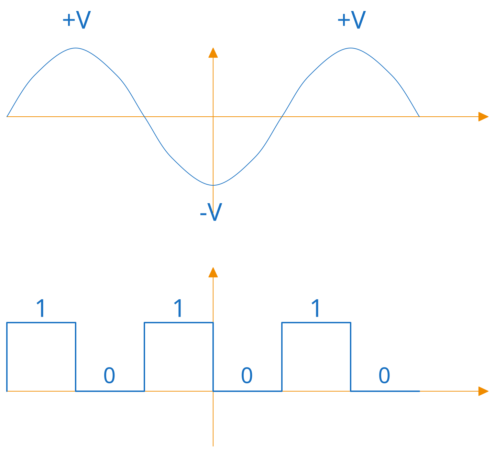

# Introduction to Digital Electronics

Digital electronics forms the mathematical and physical substrate upon which all modern computing systems are constructed. It governs how physical attributes, primarily continuous voltage levels, are abstracted into discrete symbols capable of performing deterministic logical operations, storing state, and processing information.

## Purpose and High-Level Overview

In physical reality, natural phenomena exist along a continuum. Variables such as temperature, pressure, acoustic waves, and electromagnetic field strengths vary continuously over time. Early computing systems modeled these physical systems using analog circuits, where electrical voltage or current directly mirrored the continuous physical quantity being measured.

However, continuous representation exhibits a fundamental engineering limitation: infinite continuous states imply infinite vulnerability to electrical noise. Every physical component, transmission line, and semiconductor junction introduces thermal noise and signal degradation. In an analog system, noise overlays directly onto the signal, permanently altering the underlying data without any possibility of exact recovery.

Digital electronics resolves this fundamental instability through spatial and mathematical discretization. By defining strict voltage thresholds, continuous physical ranges are compressed into discrete logic states, most commonly binary states denoted as $0$ and $1$ (or *LOW* and *HIGH*). 

This binary abstraction provides noise immunity. As long as physical interference does not cross the standardized threshold boundaries between logic levels, the system regenerates the original discrete value perfectly, eliminating cumulative signal degradation across multi-stage processing networks.

## Historical Context and Scientific Pioneers

The theoretical foundation of digital electronics predates the silicon transistor by nearly a century. In 1854, English mathematician George Boole published *An Investigation of the Laws of Thought*, establishing algebraic structures tailored specifically for binary variables. Boolean algebra demonstrated that classical logical statements could be analyzed systematically using mathematical formalisms consisting of binary inputs and basic logical operations (AND, OR, NOT).

For decades, Boole's work remained a purely theoretical branch of mathematics. In 1937, American mathematician and engineer Claude Shannon recognized the direct equivalence between Boolean algebra and physical switching networks in his master's thesis at MIT. Shannon demonstrated that electromechanical relays (and subsequently vacuum tubes and transistors) could implement Boolean logic operations directly. By routing electrical switches in specific series and parallel arrangements, physical hardware could evaluate complex logical expressions automatically.

The transition from vacuum tubes to solid-state semiconductors in the mid-20th century, culminating in the invention of the Integrated Circuit (IC) by Jack Kilby and Robert Noyce, allowed millions (and now billions) of binary logic switches to be fabricated onto a single monolithic piece of silicon.

## Structural Pillars of the Module

To master the design, analysis, and implementation of digital hardware, this module is organized into four core architectural pillars:

1. **Number Systems and Information Encoding:** Formulates the mathematical frameworks required to represent numeric values, signed quantities, characters, and system states using binary, hexadecimal, octal, and specialized codes such as Binary-Coded Decimal (BCD).
2. **Combinational Logic Circuits:** Analyzes memoryless hardware networks where output states depend strictly on the instantaneous combination of current inputs. This pillar encompasses fundamental logic gates, Boolean algebraic simplification, Karnaugh mapping, multiplexers, decoders, and arithmetic circuits.
3. **Sequential Logic Systems:** Introduces time-dependency and memory mechanisms into hardware. By using feedback loops, sequential logic elements (latches, flip-flops, registers, and counters) retain operational state, enabling synchronized system behavior driven by global clock signals.
4. **Digital Systems Architecture:** Integrates combinational and sequential subsystems into functional computing architectures, examining control units, datapaths, memory structures, and Arithmetic Logic Units (ALUs).

## Real-World Applications and Engineering Impact

The principles of digital electronics govern nearly every modern technical domain:

* **Microprocessor Design and Embedded Systems:** Modern CPUs, Graphics Processing Units (GPUs), and microcontrollers execute software commands through billions of cascaded logic gates operating at gigahertz clock frequencies.
* **Telecommunications and Networking:** Digital signal processing enables robust data transmission across fiber-optic cables, satellite links, and cellular networks by applying error detection and correction algorithms directly to digital bitstreams.
* **Control Systems and Robotics:** Industrial automation controllers sample physical sensors, process input data via digital logic, and generate precise operational signals to actuate mechanical systems.
* **Data Storage Infrastructures:** Solid-state drives (SSDs), magnetic disks, and semiconductor RAM store vast volumes of human knowledge with absolute fidelity by mapping physical charges or magnetic domains directly to binary states.