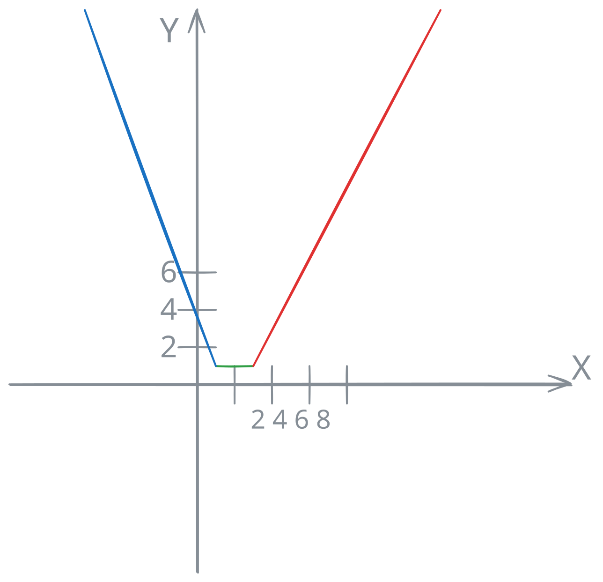
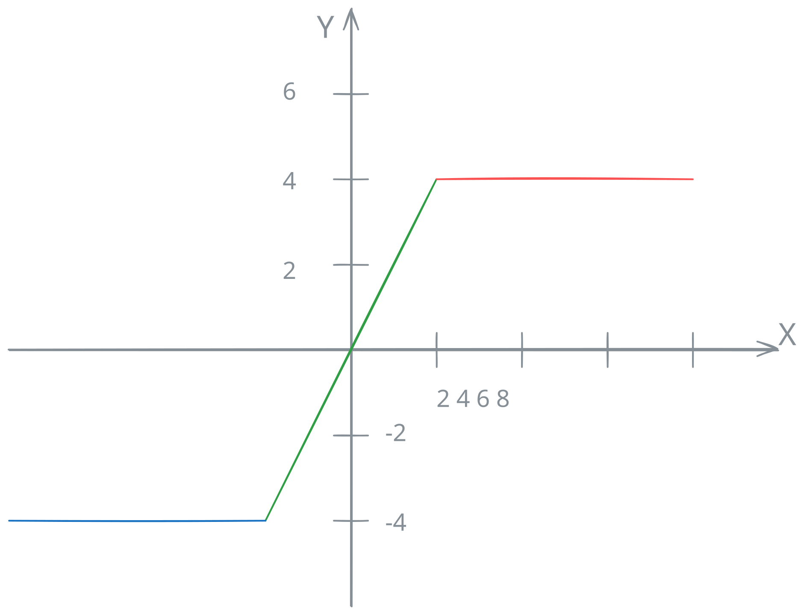

# Absolute Value Functions

An absolute value function is a function $f: \mathbb{R} \to \mathbb{R}$ where the independent variable $x$ appears within at least one absolute value expression.

While standard polynomial functions produce smooth curves, absolute value functions introduce **sharp turns ("corners" or "cusps")** at their critical points, making them fundamental objects of study in real analysis and calculus.

---

## The Universal General Method: Piecewise Conversion

The general method for graphing and analyzing any absolute value function is to **eliminate the absolute value bars by converting the function into a piecewise-defined function**.

Recall the piecewise rule for a function argument:

$$|g(x)| = \begin{cases} g(x), & \text{if } g(x) \ge 0 \\ -g(x), & \text{if } g(x) < 0 \end{cases}$$

---

### The Construction Algorithm

* **Find Critical Points:** Solve $g(x) = 0$ for all expressions inside absolute value bars.
* **Partition the Domain:** Divide the real line $\mathbb{R}$ into subintervals bounded by these critical points.
* **Define Piecewise Branches:** Evaluate the sign of each argument within every subinterval and replace $|g(x)|$ accordingly.
* **Plot and Connect:** Plot the local functions for each interval and connect them at the boundary points (critical points).

---

### Demonstrative Example: Sum of Absolute Values

**Function:** $f(x) = |x - 1| + |x - 3|$

#### Critical Points
* $x - 1 = 0 \implies x = 1$
* $x - 3 = 0 \implies x = 3$

#### Piecewise Construction

* **Interval I ($x < 1$):**  
  Both terms are negative:
  $$f(x) = -(x - 1) - (x - 3) = -2x + 4$$

* **Interval II ($1 \le x \le 3$):**  
  First term is non-negative, second is non-positive:
  $$f(x) = (x - 1) - (x - 3) = 2$$

* **Interval III ($x > 3$):**  
  Both terms are positive:
  $$f(x) = (x - 1) + (x - 3) = 2x - 4$$

#### Consolidated Piecewise Definition

$$f(x) = \begin{cases} -2x + 4, & \text{if } x < 1 \\ 2, & \text{if } 1 \le x \le 3 \\ 2x - 4, & \text{if } x > 3 \end{cases}$$

> **Geometric Result:** A "trough" shape (bathtub curve) with a constant minimum value $y = 2$ on the interval $[1, 3]$.
> * **Domain:** $\text{Dom}(f) = \mathbb{R}$
> * **Range (Image):** $\text{Im}(f) = [2, +\infty)$

---

## Geometric Transformations (Graphic Shortcuts)

For elementary composite functions based on a known base graph $y = g(x)$, reflection shortcuts allow rapid sketching without full domain partitioning.

### Case 1: $y = |g(x)|$ (Outer Reflection)
Reflects the negative outputs across the x-axis.

1. Sketch the standard graph of $y = g(x)$.
2. Keep all parts where $g(x) \ge 0$ untouched.
3. **Reflect the parts below the x-axis ($g(x) < 0$) upward** (reflect across the x-axis).

$$\text{Im}(f) \subseteq [0, +\infty)$$

---

### Case 2: $y = g(|x|)$ (Inner Reflection)
Forces y-axis symmetry (creates an even function: $f(-x) = f(x)$).

1. Sketch the graph of $y = g(x)$ for $x \ge 0$ only.
2. Discard the portion of the graph where $x < 0$.
3. **Reflect the $x \ge 0$ portion across the y-axis** to form the left half ($x < 0$).

---

## Exotic Cases and Pitfalls

### Pitfall 1: Non-Differentiability at Critical Points ("Corners")
**Concept:** Absolute value functions are continuous everywhere on $\mathbb{R}$, but they are **not differentiable** at their critical points.

**Example:** $f(x) = |x|$ at $x = 0$.
* Left derivative: $\lim_{h \to 0^-} \frac{|0+h| - 0}{h} = \frac{-h}{h} = -1$
* Right derivative: $\lim_{h \to 0^+} \frac{|0+h| - 0}{h} = \frac{h}{h} = 1$

Since the left-hand and right-hand limits of the difference quotient are not equal, the derivative $f'(0)$ does not exist. The graph features a sharp corner at $(0,0)$.

---

### Pitfall 2: Difference of Absolute Values (Bounded Range)
**Problem:** Analyze domain, range, and sketch $f(x) = |x + 2| - |x - 2|$.

**Resolution via General Method:**
Critical points at $x = -2$ and $x = 2$.

* **Interval I ($x < -2$):** $f(x) = -(x + 2) - [-(x - 2)] = -x - 2 + x - 2 = -4$
* **Interval II ($-2 \le x \le 2$):** $f(x) = (x + 2) - [-(x - 2)] = x + 2 + x - 2 = 2x$
* **Interval III ($x > 2$):** $f(x) = (x + 2) - (x - 2) = 4$

$$\text{Piecewise: } f(x) = \begin{cases} -4, & \text{if } x < -2 \\ 2x, & \text{if } -2 \le x \le 2 \\ 4, & \text{if } x > 2 \end{cases}$$

> **Key Takeaway:** Unlike the sum of absolute values which grows to $+\infty$, the difference produces horizontal asymptotes/plateaus.
> * **Domain:** $\mathbb{R}$
> * **Range:** $\text{Im}(f) = [-4, 4]$

---

### Pitfall 3: Nested Reflections $y = ||g(x)| - k|$
**Problem:** Sketch $f(x) = ||x| - 2|$.

**Resolution via Transformations:**
1. Start with base line $y = x$.
2. Apply inner reflection $y = |x|$ (V-shape centered at origin).
3. Shift down by $2$ units: $y = |x| - 2$ (vertex at $(0, -2)$).
4. Apply outer reflection $y = ||x| - 2|$ (flips the inverted V section between $x \in [-2, 2]$ upward).

> **Result:** A "W-shaped" graph with absolute minima at $(-2, 0)$ and $(2, 0)$, and a local maximum at $(0, 2)$.
> * **Range:** $\text{Im}(f) = [0, +\infty)$

---

## Conclusion: The General Method vs. Exotic Cases

To prove that domain partition handles any continuous or non-smooth behavior without relying on geometric intuition, we resolve the nested reflection case $f(x) = ||x| - 2|$ **purely algebraically using the General Method**.

---

### Pitfall 3 via General Method: $f(x) = ||x| - 2|$

Inner critical point: $x = 0$.

* **Branch I ($x < 0$):**  
  Here $|x| = -x \implies f(x) = |-x - 2| = |-(x + 2)| = |x + 2|$.  
  Secondary critical point: $x = -2$.
  * **Sub-interval $x < -2$:** $(x + 2) < 0 \implies f(x) = -(x + 2) = -x - 2$
  * **Sub-interval $-2 \le x < 0$:** $(x + 2) \ge 0 \implies f(x) = x + 2$

* **Branch II ($x \ge 0$):**  
  Here $|x| = x \implies f(x) = |x - 2|$.  
  Secondary critical point: $x = 2$.
  * **Sub-interval $0 \le x < 2$:** $(x - 2) < 0 \implies f(x) = -(x - 2) = -x + 2$
  * **Sub-interval $x \ge 2$:** $(x - 2) \ge 0 \implies f(x) = x - 2$

#### Final Piecewise Formulation
$$f(x) = \begin{cases} -x - 2, & \text{if } x < -2 \\ x + 2, & \text{if } -2 \le x < 0 \\ -x + 2, & \text{if } 0 \le x < 2 \\ x - 2, & \text{if } x \ge 2 \end{cases}$$

Evaluating critical points confirms the W-shape: $f(-2) = 0$, $f(0) = 2$, $f(2) = 0$.