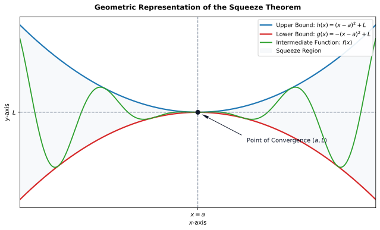

# Squeeze Theorem

When calculating limits of mathematical functions, we frequently encounter expressions whose direct evaluation is unfeasible due to incessant oscillations or indeterminate behaviors. In these scenarios, conventional algebraic techniques, such as factoring polynomials or canceling terms, prove insufficient. A fundamental question then arises: how can we determine the asymptotic trend of a function whose exact behavior is complex or unknown, but whose upper and lower bounds can be strictly delimited?

---

## The Principle of Compression

To understand the essence of this problem, consider the behavior of a particle confined to move between two approaching physical boundaries. Suppose three continuous trajectories are described along a common domain. Two of these trajectories act as inviolable borders: one bounds the path from below, while the other bounds it from above.

As the independent variable approaches a specific critical value, the lower and upper trajectories progressively converge toward the same final position. The particle located between them has no freedom to deviate beyond the established boundaries. Consequently, if the lower and upper barriers meet at the exact same point, the state of the intermediate trajectory is inevitably determined by this joint convergence.

This phenomenon of asymptotic entrapment and compression constitutes the intuitive basis for analyzing compressed oscillatory functions. If a complex function can be "squeezed" between two simpler functions whose behaviors at the point of interest are known and identical, the limit of the intermediate function will be completely determined.

---

## Formalization and Mechanics of the Theorem

The rigorous formalization of this geometric intuition is known as the Squeeze Theorem (or Sandwich Theorem).

### Formal Statement

Let $g(x)$, $f(x)$, and $h(x)$ be functions defined on an open interval containing the point $a$, except possibly at point $a$ itself. If, for all $x$ in this interval (with $x \neq a$), the inequality holds:

$$g(x) \le f(x) \le h(x)$$

and if the limits of the outer functions at point $a$ exist and are equal, that is:

$$\lim_{x \to a} g(x) = L \quad \text{and} \quad \lim_{x \to a} h(x) = L$$

then the limit of the intermediate function $f(x)$, as $x$ approaches $a$, exists and is given by:

$$\lim_{x \to a} f(x) = L$$

*Figure 1: Geometric representation of the Squeeze Theorem. The intermediate function $f(x)$ is squeezed between the upper boundary $h(x)$ and the lower boundary $g(x)$, forcing its limit to $L$ as $x \to a$.*

---

## Corollaries and Derived Properties

One of the most fruitful applications of the Squeeze Theorem occurs when analyzing the product of a function that approaches zero and a function whose value remains bounded throughout its domain.

### The Bounded-Times-Null Property

Let $f(x) = g(x) \cdot h(x)$. If $\lim_{x \to a} g(x) = 0$ and if the function $h(x)$ is bounded in a neighborhood of $a$ (that is, there exist real constants $M > 0$ and $N > 0$ such that $-M \le h(x) \le N$ for all $x \neq a$), then:

$$\lim_{x \to a} [g(x) \cdot h(x)] = 0$$

#### Proof

By the boundedness of $h(x)$, we have for all $x$ in the considered neighborhood:

$$-M \le h(x) \le N$$

Assuming initially that $g(x) \ge 0$ as $x$ approaches $a$, we multiply all members of the inequality by $g(x)$:

$$-M \cdot g(x) \le g(x) \cdot h(x) \le N \cdot g(x)$$

Applying the limit as $x \to a$ to the outer terms:

$$\lim_{x \to a} [-M \cdot g(x)] = -M \cdot \lim_{x \to a} g(x) = -M \cdot 0 = 0$$

$$\lim_{x \to a} [N \cdot g(x)] = N \cdot \lim_{x \to a} g(x) = N \cdot 0 = 0$$

Since the limits of both outer boundaries are equal to $0$, the Squeeze Theorem directly establishes that:

$$\lim_{x \to a} [g(x) \cdot h(x)] = 0$$

An analogous analysis applies to cases where $g(x) < 0$, confirming the general validity of the property through absolute value bounding $|g(x) \cdot h(x)| \le K \cdot |g(x)|$.

---

## Structural Applications and Model Limitations

The Squeeze Theorem plays a fundamental role in laying the foundations of Differential and Integral Calculus. It is the primary tool used in proving the **Fundamental Trigonometric Limit**:

$$\lim_{x \to 0} \frac{\sin(x)}{x} = 1$$

This identity, established geometrically by comparing the areas of triangles and the unit circular sector, subsequently allows for the derivation of all trigonometric functions.

### Applicability Constraints

The choice of bounding functions $g(x)$ and $h(x)$ requires rigor. A common failure in applying the theorem occurs when using bounding functions whose limits at point $a$ do not coincide. If $\lim_{x \to a} g(x) = L_1$ and $\lim_{x \to a} h(x) = L_2$, with $L_1 \neq L_2$, the theorem provides no information regarding the existence or value of the limit of $f(x)$.

Furthermore, the method requires the intermediate function to be strictly bounded within the considered interval. Functions such as tangent ($\tan(x)$) or cosecant ($\csc(x)$) exhibit vertical asymptotic discontinuities in the real domain, making them unbounded in neighborhoods of their singular points and preventing direct squeezing.

---

## Problem Solving

### Example 1: Infinite Convergence of Trigonometric Ratios

Determine the value of the limit:

$$\lim_{x \to \infty} \frac{\sin(x)}{x}$$

#### Solution

1. **Identification of component behavior:** The sine function satisfies the standard amplitude bound for all $x \in \mathbb{R}$:

   $$-1 \le \sin(x) \le 1$$

2. **Construction of inequalities:** Considering the domain where $x > 0$ (since $x \to \infty$), we divide all terms of the inequality by $x$:

   $$-\frac{1}{x} \le \frac{\sin(x)}{x} \le \frac{1}{x}$$

3. **Calculation of outer limits:**

   $$\lim_{x \to \infty} \left(-\frac{1}{x}\right) = 0$$

   $$\lim_{x \to \infty} \left(\frac{1}{x}\right) = 0$$

4. **Conclusion via the Squeeze Theorem:** Since the function $f(x) = \frac{\sin(x)}{x}$ is bounded between two expressions that approach $0$ as $x \to \infty$, it strictly follows that:

   $$\lim_{x \to \infty} \frac{\sin(x)}{x} = 0$$

---

### Example 2: Polynomial Damping Around the Origin

Calculate the limit:

$$\lim_{x \to 0} x^4 \sin\left(\frac{1}{x}\right)$$

#### Solution

1. **Discontinuity analysis:** The expression $\sin(1/x)$ exhibits infinite frequency oscillation as $x$ approaches $0$. Direct evaluation by substitution is undefined.

2. **Applying the squeeze:** Knowing that the range of the sine function is contained within the interval $[-1, 1]$, we have:

   $$-1 \le \sin\left(\frac{1}{x}\right) \le 1 \quad \forall x \neq 0$$

3. **Multiplication by factor $x^4$:** Since $x^4 > 0$ for all $x \neq 0$, the inequality direction is preserved:

   $$-x^4 \le x^4 \sin\left(\frac{1}{x}\right) \le x^4$$

4. **Evaluation of outer limits:**

   $$\lim_{x \to 0} (-x^4) = 0$$

   $$\lim_{x \to 0} x^4 = 0$$

5. **Application of the Bounded-Times-Null Property:** Both outer boundaries converge to $0$. Therefore:

   $$\lim_{x \to 0} x^4 \sin\left(\frac{1}{x}\right) = 0$$

---

### Example 3: Limits Involving Arc-Tangent Relations

Calculate the limit:

$$\lim_{x \to \infty} \frac{\arctan(x)}{x}$$

#### Solution

1. **Arc-tangent boundedness analysis:** The range of $y = \arctan(x)$ is strictly bounded by horizontal asymptotes at $y = \pm \frac{\pi}{2}$:

   $$-\frac{\pi}{2} < \arctan(x) < \frac{\pi}{2} \quad \forall x \in \mathbb{R}$$

2. **Division by variable $x$ ($x > 0$):**

   $$-\frac{\pi}{2x} < \frac{\arctan(x)}{x} < \frac{\pi}{2x}$$

3. **Taking the limit:**

   $$\lim_{x \to \infty} \left(-\frac{\pi}{2x}\right) = 0$$

   $$\lim_{x \to \infty} \left(\frac{\pi}{2x}\right) = 0$$

4. **Verdict:** By the Squeeze Theorem:

   $$\lim_{x \to \infty} \frac{\arctan(x)}{x} = 0$$