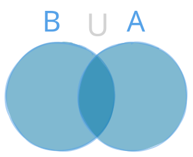
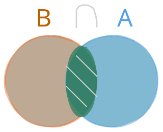
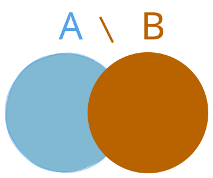
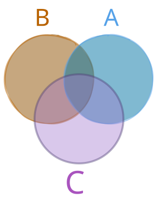

# Operational Theory and Set Algebra

## From Axiomatic Foundations to Practical Language
In the previous chapter, we explored the inner workings of mathematics: the axioms of Set Theory (ZFC) that ensure the system does not collapse into contradictions. However, just as we do not need to compute quantum mechanics to use a computer, we do not need to manipulate axioms to use sets in practice.

With the guarantee that the system is sound, we can move forward to the visible language of mathematics. The fundamental concept of a Set is intuitive: it is any well-defined collection of objects, called elements.

---

## The Concept and Notation of Sets
To prevent ambiguity when communicating mathematical ideas, a rigid universal notation is established to represent sets and their elements.

### Notation Conventions
* **Sets:** Represented by uppercase letters of the alphabet ($A, B, C, \dots, X, Y, Z$).
* **Elements:** Represented by lowercase letters ($a, b, c, \dots, x, y, z$).
* **Grouping:** Elements of a set are always enclosed in curly braces ($\{\dots\}$) and separated by commas.

### The Two Ways to Declare a Set
There are two universal ways to define which elements belong to a collection.

#### Extension Declaration (Explicit Listing)
Elements are individually listed within the braces. This format is ideal for small, finite sets.
$$A = \{2, 4, 6, 8\}$$

#### Comprehension Declaration (Logical Filter)
Instead of listing element by element, a property or filter condition $P(x)$ is defined, which every element $x$ must satisfy to belong to the set. A vertical bar ($\mid$) or a colon ($:$) is used to mean "such that".
$$A = \{x \in \mathbb{N} \mid x \text{ is even and } 0 < x < 10\}$$

Reading: *"A is the set of all elements x belonging to the natural numbers such that x is even and strictly between 0 and 10."*

---

## Fundamental Relations: Belonging and Inclusion
Set theory establishes two distinct relationships: the relationship between an object and a collection (belonging) and the relationship between two collections (inclusion).

### Belonging Relation ($\in$ and $\notin$)
Belonging associates an individual element with a set.

* **Belongs ($\in$):** The element is part of the set.
  $$x \in A$$
* **Does Not Belong ($\notin$):** The element is not part of the set.
  $$y \notin A$$

**Example:**
Given the set $A = \{2, 4, 6\}$:
* $2 \in A$
* $3 \notin A$

**Formal Precautions:**
* Belonging strictly relates an element to a set.
* The symbol $\in$ must not be used to directly relate two sets to each other, except in the specific case where a set is itself an element of another set (such as in the Power Set).

### The Formal Concept of a Subset
A set $A$ is defined as a subset of $B$ if, and only if, all elements of $A$ also belong to $B$.
Inclusion requires the totality of elements in $A$. If there is even a single element in $A$ that does not belong to $B$, the relation $A \subseteq B$ is false.

### Inclusion Relation ($\subseteq, \subsetneq, \supseteq, \nsubseteq$)
Inclusion establishes the relationship between a subset and the set containing it.
$$A \subseteq B \iff (\forall x)(x \in A \implies x \in B)$$

#### Symbols and Readings
* **Subset / Contained ($\subseteq$):** $A \subseteq B$ ($A$ is contained in $B$). Guarantees that every element of $A$ is in $B$, allowing equality ($A = B$).
* **Proper Subset ($\subset$ or $\subsetneq$):** $A \subsetneq B$ ($A$ is properly contained in $B$). Requires that all elements of $A$ belong to $B$ AND that $B$ contains at least one element that does not belong to $A$ ($A \neq B$).
* **Not Contained ($\nsubseteq$):** $A \nsubseteq B$ (there exists at least one element in $A$ that does not belong to $B$).
* **Contains ($\supseteq$):** $B \supseteq A$ ($B$ contains the set $A$).

#### Crucial Distinction: Subset ($\subseteq$) vs. Proper Subset ($\subsetneq$)
The inclusion relation is analogous to numerical comparisons:
* $\subseteq$ functions like $\le$ (less than or equal to): Allows sets to be identical.
* $\subsetneq$ functions like $<$ (strictly less than): Requires the first set to be strictly smaller than and different from the second.

#### The Case of Equality and Self-Inclusion ($A = B$)
Because the definition of subset ($\subseteq$) allows equality:
* **Every set is a subset of itself:** $A \subseteq A$ is always true.
* **If $A = B$:** The statement $A \subseteq B$ is true because all elements of $A$ are in $B$. However, the statement $A \subsetneq B$ is false because there is no exclusive element in $B$.

#### Practical Example
Given the sets $A = \{1, 2\}$, $B = \{1, 2, 3\}$, $C = \{3, 4\}$, and $D = \{1, 2\}$:
* $A \subseteq B$ (true, as all elements of $A$, $1$ and $2$, belong to $B$).
* $A \subsetneq B$ (true, as $A \subseteq B$ and the element $3 \in B$ does not belong to $A$).
* $A \subseteq D$ (true, because $A = D$).
* $A \subsetneq D$ (false, because $A = D$).
* $C \nsubseteq B$ (true, because although $3 \in C$ belongs to $B$, the element $4 \in C$ does not belong to $B$).

#### Formal Precautions
* **Requirement of Totality:** The presence of only some elements of one set inside another does not validate inclusion. Only the totality of elements guarantees $A \subseteq B$.
* **Structural Distinction (Element vs. Set):** The element $2$ and the singleton set $\{2\}$ are distinct mathematical objects. For $A = \{2, 4\}$, the correct form is $2 \in A$ and $\{2\} \subseteq A$. Writing $2 \subseteq A$ or $\{2\} \in A$ constitutes a formal error.
* **The Empty Set:** The empty set ($\emptyset$) is a subset of any set ($\emptyset \subseteq A, \forall A$), as the condition "every element of $\emptyset$ belongs to $A$" is vacuously true.
* **Reflexivity:** Every set is an (improper) subset of itself ($A \subseteq A$).

---

## Fundamental Operations
Set operations act as the arithmetic operators of collections, allowing new sets to be constructed from existing ones.

### Union ($A \cup B$) — The Logical OR ($\lor$)

Combines all elements belonging to $A$, $B$, or both into a single collection.
$$A \cup B = \{x \mid x \in A \lor x \in B\}$$

* **Logical Connection ($\lor$):** The union symbol ($\cup$) directly mirrors the logical OR ($\lor$). An element enters the union if it satisfies being in $A$ OR being in $B$ (or both).
* **Numerical Example:** If $A = \{1, 2, 3\}$ and $B = \{3, 4, 5\}$, then $A \cup B = \{1, 2, 3, 4, 5\}$.
* **Practical Analogy (The Door Test):** Imagine $A$ is the VIP List and $B$ is the Guest List for an event. To enter ($A \cup B$), the rule at the door is: *"Are you on List A OR List B?"*. If Carlos is on both lists, he answers "Yes!" and gains entry. He enters as a single person — being on two lists guarantees the right to enter, but does not clone Carlos inside the venue.
* **Theoretical Note (Why are repeated elements not counted?):** When joining $A$ and $B$, the element $3$ is present in both sets. The raw result of the junction would be $\{1, 2, 3, 3, 4, 5\}$. However, by the Axiom of Extensionality, two sets are identical if they contain exactly the same elements. Repeating $3$ adds no new object to the collection, so $\{1, 2, 3, 3, 4, 5\}$ and $\{1, 2, 3, 4, 5\}$ are the exact same set. Therefore, duplicates are omitted.

### Intersection ($A \cap B$) — The Logical AND ($\land$)

Filters and preserves exclusively the elements present simultaneously in both sets.
$$A \cap B = \{x \mid x \in A \land x \in B\}$$

* **Logical Connection ($\land$):** The intersection symbol ($\cap$) directly mirrors the logical AND ($\land$). An element enters the intersection strictly if it is in $A$ AND in $B$.
* **Numerical Example:** If $A = \{1, 2, 3\}$ and $B = \{3, 4, 5\}$, then $A \cap B = \{3\}$.
* **Practical Analogy (The Restricted Area):** Imagine a private room inside the party that requires a person to be on the VIP List AND on the Guest List at the same time. Ana (only on List A) is denied entry. Carlos (present on both) meets the condition and passes. The intersection set consists solely of people in Carlos's situation.

### Difference ($A \setminus B$) — The Logical NOT ($\neg$)

Subtracts from set $A$ all elements that also belong to set $B$.
$$A \setminus B = \{x \mid x \in A \land x \notin B\}$$

* **Logical Connection:** Combines belonging AND ($\land$) with negation NOT ($\notin$).
* **Numerical Example:** If $A = \{1, 2, 3\}$ and $B = \{3, 4, 5\}$, then $A \setminus B = \{1, 2\}$.
* **Practical Analogy (Exclusivity Filter):** The organizer wants to know who is on the VIP List ($A$) but NOT on the Guest List ($B$). They take List A and cross off Carlos, since Carlos is also a guest. Only exclusive VIPs remain (like Ana).

### Complement ($A^c$) — Absolute Negation
![the complemente][../../../../assets/set-theory-complement.svg]
Maps all elements belonging to the universal set $U$ that do not belong to set $A$.
$$A^c = \{x \in U \mid x \notin A\} = U \setminus A$$

* **Numerical Example:** If the universe under analysis is $U = \{1, 2, 3, 4, 5\}$ and $A = \{1, 2\}$, then $A^c = \{3, 4, 5\}$.
* **Practical Analogy (Who Was Left Out):** If Universe $U$ represents all citizens in a city, the complement $A^c$ is the group of citizens who are NOT on the VIP List.

> **Note:** The universal set ($U$) varies depending on the context of the problem. While it is frequently the set of Real Numbers ($\mathbb{R}$) in analysis and finance, it can be any well-defined domain — such as a set of people, rows in a table, or the entire complex plane ($\mathbb{C}$).

---

## Spatial Visualization: The Venn Diagram

The Venn Diagram is the universal graphical tool used to geometrically represent relations and overlaps between sets. Each set is drawn as a region bounded by a closed curve (usually a circle), while the enclosing rectangle defines the Universal Set ($U$).

### Mapping Diagram Regions
* **Triple Intersection** ($A \cap B \cap C$): The central core where all three circles overlap simultaneously.
* **Only A** ($A \setminus (B \cup C)$): The region of circle $A$ excluding any overlap with $B$ or $C$.
* **Only B** ($B \setminus (A \cup C)$): The region of circle $B$ excluding any overlap with $A$ or $C$.
* **Only C** ($C \setminus (A \cup B)$): The region of circle $C$ excluding any overlap with $A$ or $B$.
* **Intersection of Only A and B** ($(A \cap B) \setminus C$): The overlapping area between $A$ and $B$, excluding the section that touches $C$.
* **Intersection of Only A and C** ($(A \cap C) \setminus B$): The overlapping area between $A$ and $C$, excluding the section that touches $B$.
* **Intersection of Only B and C** ($(B \cap C) \setminus A$): The overlapping area between $B$ and $C$, excluding the section that touches $A$.
* **Total Union** ($A \cup B \cup C$): The entire area covered by all three circles combined.
* **Complement** ($(A \cup B \cup C)^\complement$): The entire region outside all three circles, bounded within the Universal set rectangle ($U$).

---

## Logical Simplification: De Morgan's Laws
De Morgan's Laws describe the interaction between negation (the Complement operator) and the Union and Intersection operations, allowing complex logical conditions to be rewritten and simplified.

### First Law: Complement of the Union
The complement of the union of two sets is equal to the intersection of their individual complements.
$$(A \cup B)^c = A^c \cap B^c$$

* **Practical Application:** Negating the condition *"The person lives in New York OR is a Premium Client"* is equivalent to requiring that *"The person does NOT live in New York AND is NOT a Premium Client"*.

### Second Law: Complement of the Intersection
The complement of the intersection of two sets is equal to the union of their individual complements.
$$(A \cap B)^c = A^c \cup B^c$$

* **Practical Application:** Negating the condition *"The person is a Physician AND an Engineer"* is equivalent to accepting that *"The person is NOT a Physician OR is NOT an Engineer"*.

---

## The Power Set and Combinatorics
The Power Set of $A$, denoted by $\mathcal{P}(A)$, represents the collection of all possible subsets extracted from $A$, including the empty set ($\emptyset$) and the set $A$ itself.

### Example
Given the set of choices $A = \{\text{Option 1}, \text{Option 2}\}$:
* Subset with no choices: $\emptyset$
* Singleton subsets: $\{\text{Option 1}\}$ and $\{\text{Option 2}\}$
* Subset with all choices: $\{\text{Option 1}, \text{Option 2}\}$

The complete structure yields:
$$\mathcal{P}(A) = \{\emptyset, \{\text{Option 1}\}, \{\text{Option 2}\}, \{\text{Option 1}, \text{Option 2}\}\}$$

### Cardinality Calculation
For any finite set containing $n$ elements, the total number of possible subsets grows at an exponential rate with base 2:
$$|\mathcal{P}(A)| = 2^n$$

---

## Operational Summary
Set Algebra transforms descriptive logic into an efficient operational calculus. Mastering notation, core operations ($\cup, \cap, \setminus, c$), combined with spatial visualization via Venn Diagrams and simplification through De Morgan's Laws, consolidates the necessary foundation for data modeling, probability, and analytical logic.