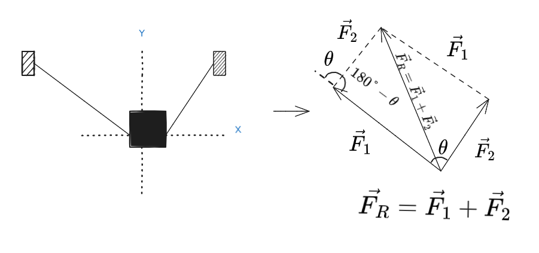
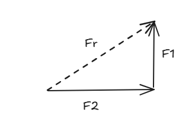
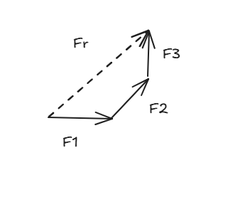
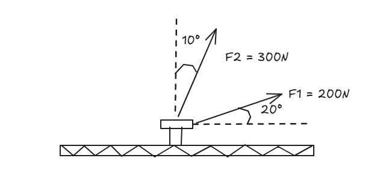

# Planar Force Addition: Geometry and Rigor

In static equilibrium and vector kinematics, a single isolated force is rarely encountered. Determining the resultant force simplifies complex physical systems into a single equivalent effect. The choice of geometric method depends directly on the number of concurrent forces and the spatial geometry of the system.

---

## Motivation and Formal Definition

The addition of physical vectors differs from scalar arithmetic because both magnitude and spatial direction must be preserved. 

For concurrent forces acting at a single point, vector composition establishes an equivalent system:

$$\vec{F}_R = \sum_{i=1}^{n} \vec{F}_i = \vec{F}_1 + \vec{F}_2 + \dots + \vec{F}_n$$

Where $\vec{F}_R$ represents the resultant force vector that produces the same translational effect as all individual forces combined.

---

## Classification and Boundary Cases

### The Parallelogram Law and Its Boundaries

The Parallelogram Law is the fundamental geometric method for combining **exactly two concurrent forces**. The component forces form adjacent sides of a parallelogram, and the resultant vector extends along the diagonal originating from the common point.

> [!NOTE]
> **Boundary Limitation:** The Parallelogram Law cannot combine three or more forces simultaneously. For $n > 2$ forces, vectors must be added iteratively in pairs or processed using the Polygonal Rule.

### The Triangle and Polygonal Rules

To streamline calculations, the **Triangle Rule** bisects the parallelogram. The tail of the second vector is positioned at the head of the first vector; the resultant vector closes the triangle from the initial tail to the final head.

When evaluating three or more forces ($n \ge 3$), the method generalizes into the **Polygonal Rule**:

1. Vectors are stacked sequentially in a head-to-tail arrangement.
2. The resultant force $\vec{F}_R$ is drawn from the tail of the initial vector to the tip of the final vector.
3. If the vector polygon closes perfectly onto the origin, the resultant vector is zero ($\vec{F}_R = \vec{0}$), proving static equilibrium graphically.

| Method | Applicable Forces ($n$) | Geometric Topology | Resultant Condition |
| :--- | :---: | :--- | :--- |
| **Parallelogram Law** | $n = 2$ | Diagonal of formed parallelogram | $\vec{F}_R = \vec{F}_1 + \vec{F}_2$ |
| **Triangle Rule** | $n = 2$ | Head-to-tail triangle closure | $\vec{F}_R = \vec{F}_1 + \vec{F}_2$ |
| **Polygonal Rule** | $n \ge 3$ | Head-to-tail closed or open polygon | $\vec{F}_R = \sum \vec{F}_i$ |

  

---

## Proof and Mathematical Formulation

### Trigonometric Resolution via Law of Cosines and Law of Sines

When two forces $\vec{F}_1$ and $\vec{F}_2$ form an interior angle $\beta$ in a head-to-tail triangle, the magnitude of the resultant force $F_R$ is calculated using the **Law of Cosines**:

$$F_R = \sqrt{F_1^2 + F_2^2 - 2 F_1 F_2 \cos(\beta)}$$

The direction angle $\theta$ relative to vector $\vec{F}_1$ is obtained using the **Law of Sines**:

$$\frac{F_2}{\sin(\theta)} = \frac{F_R}{\sin(\beta)} \implies \sin(\theta) = \frac{F_2 \sin(\beta)}{F_R}$$

---

## Practical Application and Worked Examples

### Worked Example: Geometric Addition on an Anchor Bolt

An anchor bolt embedded in a steel base plate is subjected to two cable tension forces, $\vec{F}_1$ and $\vec{F}_2$. Force $\vec{F}_1$ has a magnitude of $200\text{ N}$ at $20^\circ$ above the positive $x$-axis. Force $\vec{F}_2$ has a magnitude of $300\text{ N}$ at $10^\circ$ to the left of the positive $y$-axis (vertical). 

Determine the magnitude of the resultant force $\vec{F}_R$ and its orientation angle $\phi$ measured counterclockwise from the positive $x$-axis.

#### 1. Geometric Analysis (Force Triangle Construction)

The angle between $\vec{F}_1$ and $\vec{F}_2$ in the coordinate plane is:

$$\theta_{\text{plane}} = 90^\circ - (20^\circ + 10^\circ) = 60^\circ$$

Transposing $\vec{F}_2$ head-to-tail onto $\vec{F}_1$ forms an interior angle $\beta$ that is supplementary to $\theta_{\text{plane}}$:

$$\beta = 180^\circ - 60^\circ = 120^\circ$$

#### 2. Resultant Force Magnitude ($F_R$)

Applying the Law of Cosines with $\cos(120^\circ) = -0.5$:

$$F_R = \sqrt{200^2 + 300^2 - 2(200)(300) \cos(120^\circ)}$$

$$F_R = \sqrt{40000 + 90000 - (120000 \cdot (-0.5))}$$

$$F_R = \sqrt{130000 + 60000} = \sqrt{190000} \approx 435.89 \text{ N}$$

Expressing $F_R$ with 3 significant figures:

$$F_R = 436\text{ N}$$

#### 3. Direction Relative to Positive $x$-Axis ($\phi$)

Applying the Law of Sines to find the angle $\theta$ between $F_1$ and $F_R$:

$$\frac{300}{\sin(\theta)} = \frac{435.89}{\sin(120^\circ)}$$

$$\sin(\theta) = \frac{300 \cdot \sin(120^\circ)}{435.89} = \frac{300 \cdot 0.86603}{435.89} \approx 0.5960$$

$$\theta = \arcsin(0.5960) \approx 36.58^\circ$$

Combining $\theta$ with the initial $20^\circ$ elevation of $\vec{F}_1$:

$$\phi = \theta + 20^\circ = 36.58^\circ + 20^\circ = 56.58^\circ \approx 56.6^\circ$$

---

### Conceptual Pitfall: Supplementary Angle Confusion

A frequent error in force triangle construction is using the plane angle ($60^\circ$) directly in the Law of Cosines instead of the head-to-tail interior supplementary angle ($120^\circ$).

$$\text{Incorrect: } F_R = \sqrt{200^2 + 300^2 - 2(200)(300) \cos(60^\circ)} = \sqrt{70000} \approx 264.6\text{ N}$$

#### Deconstruction

Using $60^\circ$ computes the vector difference $|\vec{F}_1 - \vec{F}_2|$ rather than the vector sum $|\vec{F}_1 + \vec{F}_2|$. When vectors are translated head-to-tail, the interior angle of the resulting triangle is always $180^\circ - \theta_{\text{concurrent}}$.

---

## Connections and Advanced Applications

> [!TIP]
> **Engineering Application:** Geometric vector addition forms the foundation for truss analysis in structural engineering. When evaluating concurrent force systems at nodes, verifying that the force polygon closes is the direct graphical equivalent to applying Newton's First Law ($\sum \vec{F} = \vec{0}$).