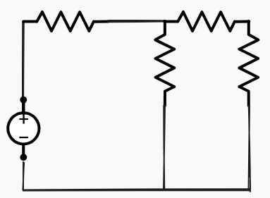
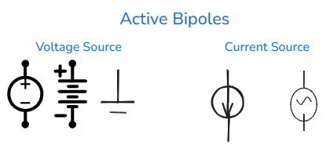

# Basic Concepts

### What is an electric circuit?

- It is an interconnection of electrical components forming closed paths through which currents circulate.
    
- In other words, electric circuits are the art of combining electronic components in a way that they work to achieve a desired goal.

### Bipole (Two-terminal element)

**Definition:**

- It is an element connected between two terminals.
    

### Active Bipoles

Components capable of supplying energy to the circuit. They are represented by the symbols below:

### Passive Bipoles

Elements that consume energy within the circuit. Examples include resistors, capacitors, and inductors.

### Electric Current

- It is the ordered movement of free electrical charges.
    
- **Definition:** It is the rate of change of charge with respect to time.
    

$$i = \frac{dq}{dt}$$

- **Note:** By using the derivative, we obtain the instantaneous current, not the average current.
    

### Current Direction: Real vs. Conventional

- **Real:** Movement of negative charges. It flows from the negative pole of the voltage source to the positive pole.
    

> [!NOTE]
> 
> **Note:** Notice that the atomic particles moving through the wire are electrons; there is no movement of positive particles. Protons, for instance, are trapped in the atomic nucleus by strong and weak nuclear forces.

- **Conventional:** Movement of positive charges. This is the direction we usually use for calculations, flowing from the positive pole of the voltage source to the negative pole. Bear in mind that in reality, the movement is the opposite.
    

### Electric Voltage (Potential Difference)

- It is the work required to move a unit of charge ($1\text{C}$) through a bipole. Moving the charge requires a certain amount of energy.
    
- Basically, it is the energy the current spends to overcome a passive bipole, such as a resistor.
    

$$V = \frac{dw}{dq}$$

$$\text{joule}/\text{coulombs} = \text{volts}$$