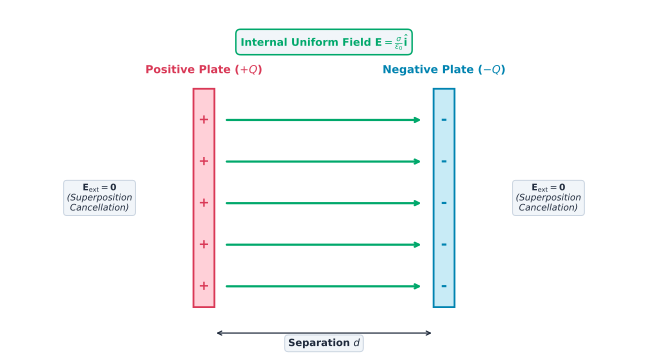

# Capacitance Foundations and Charge Separation

## Motivation and Context

Macroscopically, a capacitor is a passive two-terminal component designed to store electrostatic potential energy in space through charge separation.

Microscopically, it consists of two isolated conductors (plates or armatures) separated by an insulating medium (vacuum or dielectric). When connected to an active voltage source, the system acts as a charge pump: it removes electrons from one plate (leaving an electron deficit, charge $+Q$) and deposits them onto the opposite plate (leaving an electron excess, charge $-Q$).

The net total charge of any capacitor is strictly zero:

$$(+Q) + (-Q) = 0$$

Therefore, when physics defines the "charge of a capacitor," it refers exclusively to the magnitude of the charge $Q$ accumulated on either one of its individual conductors.

## Theoretical Formulation

### The Fundamental Capacitance Equation

The spatial separation of opposite charges establishes a potential difference (voltage) $V$ across the conductors. Experimentally, the charge $Q$ accumulated on the plates is directly proportional to this applied potential difference:

$$Q \propto V \implies Q = C \cdot V$$

Isolating the constant of proportionality yields the definition of Capacitance ($C$):

$$C = \frac{Q}{V}$$

Where:
- $Q$ is the magnitude of charge on one conductor in Coulombs ($\text{C}$).
- $V$ is the potential difference between conductors in Volts ($\text{V}$).
- $C$ is the capacitance measured in Farads ($\text{F}$), where $1\text{ F} = 1\text{ C/V}$.

### Geometric and Material Independence

Capacitance is a purely geometric and material property of the conductor arrangement. It quantifies how many Coulombs of charge the geometry can isolate per Volt of applied electrical pressure.

Capacitance does **not** depend on $Q$ or $V$. Doubling the applied voltage $V$ doubles the stored charge $Q$ proportionally, leaving the ratio $C = Q / V$ invariant.

### Electric Field Cancellation and Boundary Limits

In ideal models, the external electric field produced by a capacitor is zero. An isolated infinite plane of charge generates a uniform electric field $E = \frac{\sigma}{2\varepsilon_0}$ independent of distance.

Outside the region between two oppositely charged parallel plates, the outward electric field vector from the positive plate meets the inward electric field vector from the negative plate. By the Principle of Superposition, these equal-magnitude and opposite-direction vectors sum to zero:

$$\mathbf{E}_{\text{external}} = \mathbf{E}_{+} + \mathbf{E}_{-} = \frac{\sigma}{2\varepsilon_0}\hat{\mathbf{n}} - \frac{\sigma}{2\varepsilon_0}\hat{\mathbf{n}} = \mathbf{0}$$

#### Fringing Fields in Real Systems

Real-world plates are finite. Near the physical edges of the conductors, planar symmetry breaks down, causing electric field lines to bow outward into surrounding space. These boundary disturbances are known as **fringing fields**.

In practical engineering applications, when the plate separation $d$ is significantly smaller than the linear dimensions of the plates ($d \ll \sqrt{A}$), fringing effects are negligible, and the uniform infinite-plane approximation accurately models over 99% of the physical system.