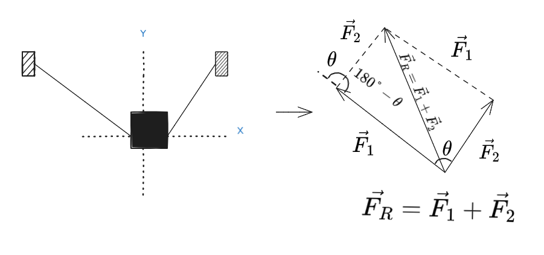
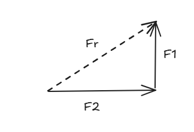
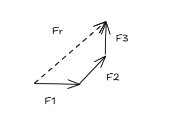
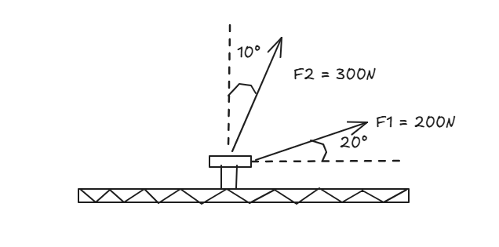

# 🏛️ Addition of Planar Forces: Geometry and Rigor

## Prerequisites

This note assumes you have mastered the following:
- **Plane Geometry:** Properties of parallelograms, alternating interior angles, and supplementary angles.
- **Trigonometry:** Direct application of the Law of Sines and Law of Cosines.
- **Vector Concept:** The fundamental distinction between scalar and vector quantities.

## The Problem of Force Composition

In statics, we rarely deal with a single isolated force. The need to find a resultant force arises to simplify complex systems into a single equivalent effect.

### The Parallelogram Law and Its Limitations

This is the fundamental method, strictly restricted to the sum of only two forces acting from the same point. The resultant is the diagonal of the parallelogram formed by the components.

### The Triangle and Polygon Rules

To optimize calculations, we use the triangle rule (half of a parallelogram). You place the tip of the first force at the origin of the second; the resultant will be the vector that closes this triangle.

When the system has multiple forces (three or more), we evolve to the **polygon rule** (tip-to-tail). If this polygon closes exactly at the starting point, the system is in equilibrium and the resultant is zero.

Example of Triangle Law:

Example of Polygonal Law:

## Reasoning Dynamics

The mathematics validates the drawing. Imagine a navigation route: the Law of Cosines measures the length of the final route, and the Law of Sines adjusts the compass (direction).

***

# 🔩 Exercise 01: Geometric Addition on a Fastening Bolt

> [!IMPORTANT] 
> 
> **Requirements**
> **- Identification of supplementary angles.**
> **- Application of the Law of Cosines for magnitude.**
> **- Terminal proficiency for asset conversion.**

### Problem Statement

A fastening bolt in a steel base is subjected to two pulling forces exerted by ropes, $\vec{F_1}$ and $\vec{F_2}$. Force $\vec{F_1}$ has a magnitude of $200\text{ N}$ at $20^\circ$ with the horizontal, while $\vec{F_2}$ has $300\text{ N}$ at $10^\circ$ with the vertical. Determine the magnitude of the resultant force ( $\vec{F_R}$ ) and its direction relative to the positive x-axis.

### Visual Representation

### Solution

**1. Geometric Analysis:**
Angle between forces: $90^\circ - (20^\circ + 10^\circ) = 60^\circ$.
Internal angle ($\beta$) for Law of Cosines (supplementary): $\beta = 180^\circ - 60^\circ = 120^\circ$.

**2. Magnitude ($F_R$):**
$$F_R = \sqrt{200^2 + 300^2 - 2(200)(300) \cos(120^\circ)} \approx 435.9\text{ N}$$

**3. Direction ($\phi$):**
Using Law of Sines to find $\theta$ (angle relative to $F_1$):
$$\frac{300}{\sin(\theta)} = \frac{435.9}{\sin(120^\circ)} \Rightarrow \theta \approx 36.6^\circ$$
Final direction relative to positive x-axis:
$$\phi = 36.6^\circ + 20^\circ = 56.6^\circ$$