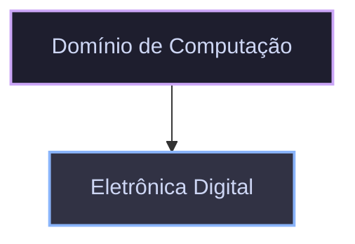

# Domínio de Computação

O domínio de **Computação** abrange os fundamentos teóricos, princípios de arquitetura de processamento e a interface de lógica discreta que sustenta os sistemas computacionais.

## Estrutura do Domínio

## Módulos Disponíveis

| Módulo                                               | Descrição                                                                                    | Status |
| :--------------------------------------------------- | :------------------------------------------------------------------------------------------- | :----- |
| [Eletrônica Digital](./eletronica-digital/README.md) | Lógica booleana, portas lógicas, circuitos combinacionais e fundamentos de hardware digital. | Ativo  |
