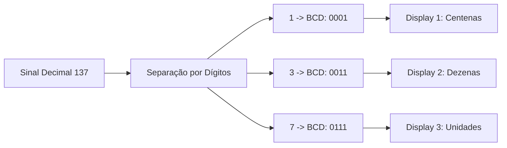

# Código BCD (Binary-Coded Decimal)

Sistemas digitais processam dados em binário puro, mas a interface humana opera no sistema decimal. Para conectar a lógica dos computadores aos mostradores digitais (como telas e relógios), o Código BCD (*Binary-Coded Decimal*) oferece um mapeamento direto entre cada dígito decimal e um grupo fixo de quatro bits.

## Do Problema à Definição

Converter um número decimal grande para binário puro exige sucessivas divisões por $2$. Para um sistema de exibição simples (como o painel de uma balança ou um voltímetro), converter todo o número para binário e depois extrair cada dígito novamente para acender os displays gera uma complexidade desnecessária.

Por exemplo, o número decimal $45_{10}$ em binário puro é $101101_2$. Para exibir esse valor em duas telas (uma para a dezena $4$ e outra para a unidade $5$), o sistema precisaria de um algoritmo para separar os dígitos.

O código BCD (especificamente a variante BCD 8421) resolve essa limitação ao codificar **cada dígito decimal de forma isolada** em um grupo de $4$ bits (chamado de tétrade):

$$
\begin{array}{rcc}
\text{Decimal:} & 4 & 5 \\
& \Downarrow & \Downarrow \\
\text{BCD 8421:} & \overbrace{0100}^{4} & \overbrace{0101}^{5}
\end{array}
$$

Dessa forma, o circuito envia a sequência $0100_2$ diretamente para a tela da dezena e a sequência $0101_2$ para a tela da unidade.

## Classificação e Comportamento

Como $4$ bits podem criar $2^4 = 16$ combinações diferentes ($0000_2$ a $1111_2$) e o sistema decimal só utiliza $10$ símbolos ($0$ a $9$), o código BCD possui combinações válidas e combinações proibidas.

### Tabela de Mapeamento BCD 8421

| Dígito Decimal | Código BCD (8421) | Estado da Combinação |
| :---: | :---: | :---: |
| $0$ | $0000$ | Válido |
| $1$ | $0001$ | Válido |
| $2$ | $0010$ | Válido |
| $3$ | $0011$ | Válido |
| $4$ | $0100$ | Válido |
| $5$ | $0101$ | Válido |
| $6$ | $0110$ | Válido |
| $7$ | $0111$ | Válido |
| $8$ | $1000$ | Válido |
| $9$ | $1001$ | Válido |
| $-$ | $1010$ a $1111$ | **Proibido (Inválido)** |

As combinações binárias equivalentes aos números de $10$ a $15$ ($1010_2$ a $1111_2$) não existem no código BCD e são consideradas erros se aparecerem na leitura.

## Construção do Modelo e Raciocínio Dedutivo

Os pesos de cada bit dentro de um tétrade BCD padrão seguem a sequência das potências de $2$:

$$\text{Pesos} = [2^3, 2^2, 2^1, 2^0] = [8, 4, 2, 1]$$

Por isso, a forma mais tradicional desse código é chamada de **BCD 8421**.

### Binário Puro vs. BCD: A Troca de Eficiência por Simplicidade

Analise a representação do número decimal $137_{10}$ nos dois sistemas:

1. **Em Binário Puro:** $137_{10} = 10001001_2$ (Exige $8$ bits de memória).
2. **Em BCD 8421:**
   * Dígito $1 \rightarrow 0001_2$
   * Dígito $3 \rightarrow 0011_2$
   * Dígito $7 \rightarrow 0111_2$
   * **Resultado em BCD:** $0001 \quad 0011 \quad 0111$ (Exige $12$ bits de memória).

O BCD consome mais espaço de memória ($12$ bits em vez de $8$), mas simplifica o direcionamento dos dados para os mostradores visuais.

## Manipulações e Propriedades Fundamentais

Para converter um número BCD de vários tétrades de volta para o sistema decimal, o procedimento é o seguinte:

1. Agrupar os bits em blocos de $4$ bits (**tétrades**), contando rigorosamente **da direita para a esquerda** (da unidade para as dezenas e centenas).
2. Se o tétrade mais à esquerda ficar incompleto (com menos de $4$ bits), preencher com zeros à esquerda.
3. Converter cada tétrade individualmente para o seu dígito decimal correspondente ($0$ a $9$).
4. Se algum tétrade resultar em um valor entre $10$ e $15$ ($1010_2$ a $1111_2$), o código recebido é inválido.

## Aplicações Práticas e Casos de Uso Profissionais

A escolha do código BCD em projetos de engenharia responde a requisitos específicos de interface de hardware, precisão financeira e redução de processamento.

---

### Exemplo 1: Processamento de Sinal e Leitura de Barramento (BCD para Decimal)

**Cenário Real:** Um voltímetro digital realiza a amostragem de uma tensão de linha. O conversor A/D disponibiliza no barramento paralelo de 12 bits a palavra binária $0111 \quad 1001 \quad 0100_{\text{BCD}}$. Determine a leitura do instrumento para exibição no painel.

**Procedimento de Engenharia:**

1. **Separação por Canais de Dígitos (Tétrades de $4$ bits):**
   $$0111 \quad 1001 \quad 0100$$

2. **Mapeamento Direto por Canal:**
   * **Canal Unidades ($k=0$):** $0100_2 = 4_{10}$
   * **Canal Dezenas ($k=1$):** $1001_2 = 9_{10}$
   * **Canal Centenas ($k=2$):** $0111_2 = 7_{10}$

3. **Leitura Final do Instrumento:**
   $$0111 \quad 1001 \quad 0100_{\text{BCD}} = 794_{10}$$

*O circuito de acionamento do display (driver) injeta cada tétrade diretamente no decodificador correspondente de cada dígito, sem necessidade de processar divisões por 10.*

---

### Exemplo 2: Validação de Integridade de Dados em Hardware

**Cenário Real:** Em um sistema crítico de monitoramento de temperatura industrial, um ruído na linha de transmissão corrompeu o barramento de dados. O microcontrolador lê dois registradores de entrada antes de enviar para o atuador:
* **Registrador A:** $0011 \quad 1010 \quad 0101$
* **Registrador B:** $1000 \quad 0110 \quad 0001$

Determine qual palavra contém erro de paridade/invalidez de codificação e deve ser descartada pelo sistema.

**Análise de Consistência de Dados:**

1. **Análise do Registrador A:**
   * Tétrade 1 (Direita): $0101_2 = 5_{10}$ (Válido)
   * Tétrade 2 (Meio): $1010_2 = 10_{10}$ (**INVÁLIDO**)
   * Tétrade 3 (Esquerda): $0011_2 = 3_{10}$ (Válido)
   * **Diagnóstico de Engenharia:** O valor $1010_2$ pertence à faixa de estados proibidos do BCD ($10_2$ a $15_2$). O sistema detecta a violação de protocolo e rejeita o registrador por corrupção de dados.

2. **Análise do Registrador B:**
   * Tétrade 1 (Direita): $0001_2 = 1_{10}$ (Válido)
   * Tétrade 2 (Meio): $0110_2 = 6_{10}$ (Válido)
   * Tétrade 3 (Esquerda): $1000_2 = 8_{10}$ (Válido)
   * **Diagnóstico de Engenharia:** Dado íntegro. O registrador representa exatamente $861_{10}$.

---

### Exemplo 3: Arredondamento Financeiro e Frações Decimais Exatas

**Cenário Real:** Em uma bomba de combustível ou sistema bancário, o valor $0{,}10_{10}$ ($10$ centavos) precisa ser armazenado. Compare o comportamento do armazenamento usando Binário Puro versus BCD 8421.

**Análise Arquitetural:**

1. **Binário Puro (Ponto Flutuante IEEE 754):**
   * A fração $0{,}1_{10}$ em binário produz uma dízima periódica infinita:
     $$0{,}1_{10} = 0{,}0001100110011..._2$$
   * Ao truncar essa sequência em $8$ ou $32$ bits, ocorrem pequenos erros de arredondamento. Em milhões de transações financeiras, esse acúmulo gera divergências de centavos no saldo final.

2. **Representação em BCD Fixo:**
   * O valor $0{,}10_{10}$ é armazenado codificando cada dígito exatamente:
     $$\text{Dígito } 1 \rightarrow 0001_2, \quad \text{Dígito } 0 \rightarrow 0000_2$$
     $$\text{Representação BCD} = 0001 \quad 0000_{\text{BCD}}$$
   * **Vantagem de Projetos Críticos:** Eliminação total de erros de truncamento em frações decimais. A precisão é garantida independentemente do número de operações.

---

### Exemplo 4: Dimensionamento de Barramento e Trade-off de Memória

**Cenário Real:** Um engenheiro precisa projetar um barramento para transportar números de $0$ a $9999_{10}$ ($4$ dígitos decimais). Calcule a largura do barramento de dados (número de linhas físicas) exigida para Binário Puro e para BCD.

**Cálculo de Infraestrutura de Hardware:**

1. **Em Binário Puro:**
   * O valor máximo é $9999_{10}$.
   * Aplica-se a capacidade de resolução binária: $2^n \ge 10000 \implies n = 14$ bits.
   * **Largura do barramento:** $14$ linhas de dados.

2. **Em BCD 8421:**
   * Cada dígito exige $1$ tétrade ($4$ bits).
   * Para $4$ dígitos decimais: $4 \times 4\text{ bits} = 16$ bits.
   * **Largura do barramento:** $16$ linhas de dados.

**Trade-off Arquitetural:** O BCD exige $2$ linhas de transmissão a mais ($16$ bits contra $14$ bits), mas descarta totalmente a necessidade de um processador interno converter o valor de binário para decimal antes de enviar para os $4$ displays do painel.

> [!TIP]
> **Decisão de Arquitetura:** Utilize **Binário Puro** para cálculos matemáticos intensivos dentro da CPU onde a densidade de memória e a velocidade da ULA são prioritárias. Utilize **BCD** em periféricos de interface humana (RTCs, balanças, taxímetros, registradores financeiros) onde a precisão decimal exata e a simplicidade de decodificação no hardware final superam o custo de memória extra.