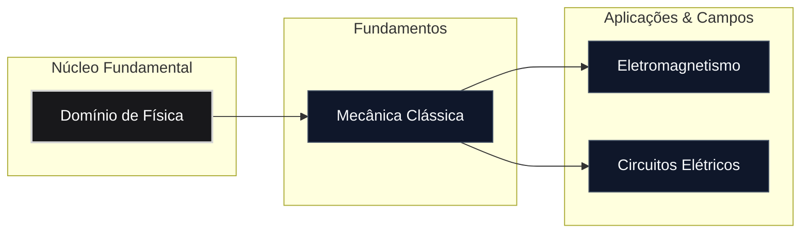

# Domínio de Física

> "If I have seen further it is by standing on the shoulders of Giants."
> — Isaac Newton

O domínio de **Física** abrange os princípios fundamentais que regem o comportamento do universo natural, desde as leis mecânicas do movimento e conservação de energia até a dinâmica de campos eletromagnéticos e teoria de circuitos.

Esta estrutura fornece a base conceitual e matemática indispensável para disciplinas avançadas de engenharia, computação e ciências exatas, permitindo a modelagem e a resolução de problemas físicos do mundo real.

## Roadmap do Domínio

## Módulos Disponíveis

| **Módulo**                                             | **Descrição**                                                                             | **Nível**     | **Status** |
| ------------------------------------------------------ | ----------------------------------------------------------------------------------------- | ------------- | ---------- |
| [Mecânica Clássica](./mecanica-classica/README.md)     | Cinemática, leis de Newton, trabalho, energia, momento e mecânica rotacional.             | Iniciante     | Ativo      |
| [Eletromagnetismo](./eletromagnetismo/README.md)       | Carga elétrica, campo elétrico, lei de Gauss, potencial, capacitância e magnetismo.       | Intermediário | Ativo      |
| [Circuitos Elétricos](./circuitos-eletricos/README.md) | Leis de Kirchhoff, métodos de análise nodal/elementar, teoremas de redes e análise em CC. | Intermediário | Ativo      |

## Pré-requisitos Gerais

- **Cálculo Diferencial e Integral:** Limites, derivadas, integrais definidas/indefinidas e noções de equações diferenciais.
    
- **Álgebra Vetorial:** Operações com vetores, produto escalar, produto vetorial e decomposição em sistemas de coordenadas.