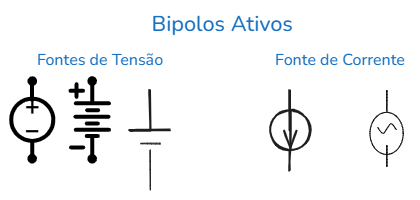
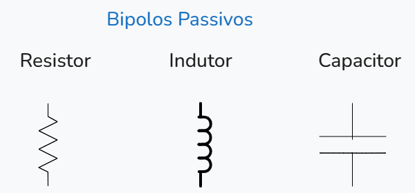

# Conceitos Básicos

### O que é um circuito elétrico?

- É uma interconexão entre componentes elétricos, de maneira a formar caminhos fechados por onde circulam correntes.
    
- Em outras palavras, os circuitos elétricos são a arte de combinar componentes eletrônicos de um jeito que funcionem para atender o objetivo buscado.
    

### Bipolo

**Definição:**

- É o elemento que está entre dois terminais.
    

### Bipolos Ativos

São os componentes que são capazes de fornecer energia para o circuito, eles são representados por esses símbolos abaixo:

### Bipolos Passivos

São os elementos que consomem energia no circuito. Alguns exemplos deles são os resistores, capacitores e indutores.

### Corrente Elétrica

- É a movimentação ordenada de cargas elétricas livres.
    
- **Definição:** É a taxa de variação da carga com relação ao tempo.
    

$$i = \frac{dq}{dt}$$

- **Obs:** Quando usamos a derivada, obtemos a corrente instantânea, não a corrente média.
    

### Sentido da corrente: Real X Convencional

- **Real:** Movimento de cargas negativas.Vai do polo negativo da fonte de tensão para o polo positivo. 

> [!NOTE]
> 
> **Perceba que a particula atômica que move pelo fio são os elétrons não tem movimento de partículas positívas, o próton por exemplo está preso no núcleo átomo por meio das forças nucleares fortes e fracas.**

    
- **Convencional:** Movimento de cargas positivas. Esse é o sentido que a gente costuma realizar os cálculo indo do polo positivo da fonte de tensão para a o polo negativo, perceba que na vida real o movimento é o contrário.
    

### Tensão Elétrica

- É o trabalho necessário para movimentar uma unidade de carga ($1\text{C}$) por meio de um bipolo. A movimentação da carga requer uma certa quantidade de energia.
    
- Basicamente é a energia que a corrente gasta para vencer a um bipolo passivo, uma resistência por exemplo.
    

$$V = \frac{dw}{dq}$$

$\text{joule}/\text{coulombs} = \text{volts}$