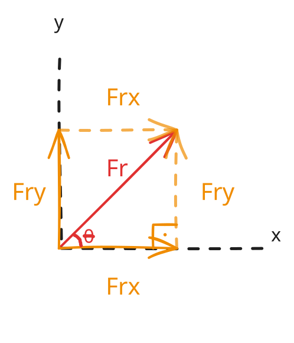
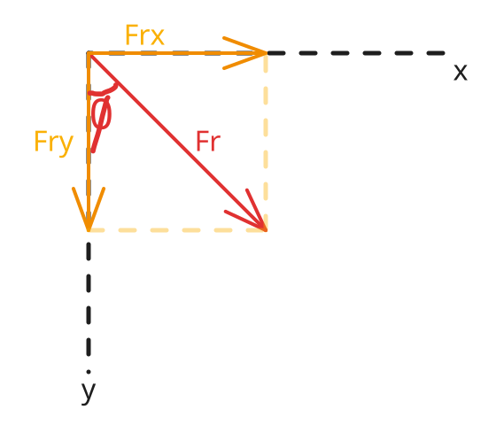

# Entendendo a Decomposição de Vetores

Você já parou para refletir que a regra do paralelogramo e da poligonal são extremamente úteis para a resolução de problemas onde temos poucas forças envolvidas? 
O problema é que, se a quantidade de forças no sistema aumentar, esses métodos geométricos começam a gerar uma teia de aranha de desenhos que dificulta absurdamente a análise. É por isso que precisamos de um método que resolva esse impasse: a decomposição.

Para entender a física por trás desse conceito, imagine que você está puxando uma mala de rodinhas no aeroporto através de uma alça inclinada. Você está aplicando uma única força diagonal.

Se observarmos o efeito prático dessa força no mundo real, notamos duas coisas acontecendo simultaneamente: a mala se desloca para a frente, na horizontal, e ao mesmo tempo fica um pouco mais leve, quase levantando do chão, na vertical.

Isso significa que a sua força diagonal, sozinha, está desempenhando dois papéis ao mesmo tempo. Decompor uma força é simplesmente o processo de traduzir essa força diagonal em duas forças imaginárias separadas — uma puramente horizontal e outra puramente vertical — que, juntas, causam exatamente o mesmo efeito prático.

Para descobrir o tamanho exato dessas forças parciais, precisamos olhar para a geometria oculta que surge quando desenhamos esses efeitos no plano cartesiano. Se projetarmos a ponta do vetor força original até o eixo horizontal e até o eixo vertical, nós fechamos uma figura geométrica perfeita.

Se você olhar fixamente para esse desenho, vai enxergar um triângulo retângulo onde a força real é a hipotenusa, e os efeitos que queremos descobrir são os catetos. Nossos ancestrais perceberam que a proporção entre os lados de um triângulo retângulo nunca muda se o ângulo for o mesmo. Eles deram nomes a essas proporções fixas.

O cosseno é apenas a razão entre a sombra colada ao ângulo (cateto adjacente) e o comprimento total da hipotenusa:

$$\cos(\theta) = \frac{F_x}{F}$$

Ao isolarmos a componente que queremos descobrir usando álgebra básica, chegamos à equação:

$$F_x = F \cdot \cos(\theta)$$

O mesmo raciocínio se aplica à componente vertical. O seno é a razão entre a sombra que está afastada, oposta ao ângulo, e a hipotenusa:

$$\operatorname{sen}(\theta) = \frac{F_y}{F}$$

Isolando a componente vertical, obtemos:

$$F_y = F \cdot \operatorname{sen}(\theta)$$

Perceba que a fórmula não é um dogma físico ou uma propriedade mágica da mecânica, mas sim a consequência direta de esticar ou encolher as proporções de um triângulo retângulo.

É por isso que decorar que o eixo horizontal sempre recebe o cosseno e o eixo vertical sempre recebe o seno é um erro que costuma cobrar caro nas provas. O cosseno está estritamente amarrado ao cateto adjacente, ou seja, àquele que está colado ao ângulo. Se a situação mudar e o problema fornecer o ângulo medido a partir do eixo vertical, toda a regra decorada desmorona.

Olhando a geometria desse novo cenário, percebemos que quem está colado ao ângulo agora é a componente vertical. Logo, a proporção do cosseno pertence a ela:

$$F_y = F \cdot \cos(\phi)$$

Por outro lado, a componente horizontal passou a ser o cateto oposto, afastado do ângulo, o que faz com que ela receba a relação do seno:

$$F_x = F \cdot \operatorname{sen}(\phi)$$

Como se vê, a resultante no eixo horizontal veio de uma projeção de seno, e não de cosseno. Se compreendermos o triângulo por trás do fenômeno, seremos capazes de montar a equação certa para qualquer situação, sem depender da posição em que o autor do livro decidiu colocar o ângulo.

Resta saber como registrar essas forças calculadas de um jeito que qualquer pessoa ou computador entenda sem precisar ver o nosso desenho. Para evitar descrições longas por extenso, a física adotou duas pequenas setas guias padronizadas que valem exatamente uma unidade de medida: os versores $\vec{i}$ e $\vec{j}$, que apontam, respectivamente, nas direções horizontais e verticais positivas.

Aqui vale um cuidado geométrico crucial: esses versores são fixos e possuem, por definição, módulo igual a um. Quando escrevemos os componentes cartesianos de uma força na forma:

$$\vec{F} = F_x\vec{i} + F_y\vec{j}$$

Não estamos alterando o tamanho desses versores unitários. O que estamos fazendo é criar **vetores equipolentes no plano**. Isso significa que as parcelas $F_x\vec{i}$ e $F_y\vec{j}$ são novos vetores que possuem a mesma direção, sentido e intensidade das projeções da nossa força, independentemente de onde ela esteja aplicada no corpo rígido. Eles não precisam nascer na origem do plano cartesiano; eles carregam a informação vetorial livre pelo espaço.

Essa notação elimina qualquer ambiguidade do problema. Se o valor escalar que multiplica o versor horizontal for negativo, sabemos instantaneamente que a componente atua para a esquerda. Se o componente vertical for positivo, ela atua para cima. Trocamos, assim, a complexidade de uma linha diagonal pela previsibilidade de duas direções ortogonais bem definidas, representadas por um par de vetores perfeitamente transportáveis.

