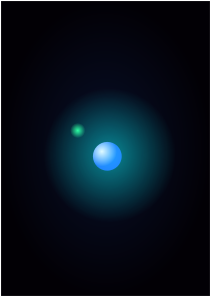

## A Natureza da Matéria

### O que é matéria?

Esta é uma daquelas perguntas clássicas que parecem simples à primeira vista, mas que guardam uma profundidade absurda. Se você perguntar a qualquer pessoa na rua, a resposta imediata provavelmente será: *“matéria é tudo aquilo que possui massa e ocupa lugar no espaço”*. 

Embora essa definição clássica e mecânica não esteja errada para o mundo macroscópico, ela peca pelo excesso de superficialidade. Dizer apenas isso é ignorar o que acontece quando descemos ao nível subatômico. Para sermos verdadeiramente precisos — como exige a Engenharia e a Física —, precisamos entender que a solidez e o volume que enxergamos no dia a dia são, na verdade, uma grande ilusão provocada por forças invisíveis.

Para compreendermos o que a matéria realmente é, precisamos fazer uma breve viagem no tempo e observar como a nossa própria definição de "realidade" foi implodida pelos modelos atômicos. É uma história de quebras de paradigma, onde a intuição humana foi forçada a ceder espaço para a abstração matemática.

---

## A Jornada do Átomo: Da Filosofia ao Vácuo

### 1. O Átomo Filosófico (Grécia Antiga)

Por volta de 400 a.C., os filósofos Demócrito e Leucipo propuseram um experimento mental: se cortarmos um pedaço de matéria repetidamente, haverá um limite? Eles teorizaram que sim, chegando a uma partícula indivisível chamada **átomo** (do grego *atamos*: "a" = não, "tomos" = divisão). 

Para eles, a matéria era puramente mecânica e intuitiva: os átomos de ferro tinham ganchos que os prendiam firmemente; os de água eram lisos e redondos, por isso ela escorria. Era uma tentativa primitiva de explicar o mundo usando formas geométricas macroscópicas.

### 2. Dalton (1808) e a "Bola de Bilhar"

Após mais de dois milênios, o químico John Dalton resgatou o termo para explicar as leis das reações químicas. Para ele, o átomo era uma esfera maciça, indestrutível e extremamente rígida. Nesse cenário, a definição de que *"matéria é tudo o que tem massa e ocupa volume"* era perfeita, pois o universo era visto como uma grande coleção de blocos de montar sólidos e impenetráveis.

### 3. Thomson (1897): A Matéria ganha Carga elétrica

A primeira grande rachadura no bloco de Dalton aconteceu quando J.J. Thomson, ao estudar raios catódicos, descobriu uma partícula subatômica milhares de vezes mais leve que o hidrogênio: o **elétron**.

* **A Quebra de Paradigma:** O átomo não era o limite; ele era divisível e possuía estrutura interna. Como a matéria no dia a dia é neutra, Thomson propôs o modelo do "pudim de passas": uma grande massa fluida positiva salpicada de elétrons negativos. Pela primeira vez na história, a **Carga Elétrica** foi introduzida como parte fundamental da estrutura da matéria.

### 4. Rutherford (1911): O Universo do Vazio

O golpe de misericórdia na nossa intuição de que a matéria é "sólida" veio com Ernest Rutherford. Ao bombardear uma finíssima folha de ouro com partículas alfa (positivas), ele esperava que elas atravessassem o "fluido" de Thomson sem grandes desvios. Para o seu absoluto choque, algumas partículas ricochetearam diretamente de volta.

* **A Quebra de Paradigma:** A matéria não é maciça. Ela é um imenso **vazio**.
Rutherford demonstrou que quase toda a massa do átomo está espremida em um ponto central minúsculo e positivo chamado núcleo, enquanto os elétrons orbitam ao redor em uma distância colossal. Para escala de engenharia: se o núcleo fosse uma moeda no centro de um estádio de futebol, a eletrosfera seria a arquibancada superior. O resto é vácuo absoluto.

### 5. Bohr (1913): A Quantização da Energia

O modelo planetário de Rutherford tinha uma falha física fatal: pela eletrodinâmica clássica, uma carga elétrica em movimento acelerado (orbitando) deve irradiar energia continuamente. Se isso fosse verdade, o elétron perderia energia rapidamente e colapsaria contra o núcleo em uma fração de segundo. O universo deixaria de existir.

Niels Bohr resolveu isso aplicando as primeiras ideias da Mecânica Quântica. Ele postulou que os elétrons não orbitam em qualquer lugar, mas sim em **órbitas estacionárias quantizadas**. O elétron só pode existir em níveis discretos de energia e não irradia nada enquanto estiver neles; ele só interage com o exterior quando dá um "salto quântico" exato entre esses níveis.

---

## A Formalização Moderna: O que é Matéria?

Ao cruzarmos a fronteira da física moderna, percebemos que o modelo de órbitas duras de Bohr também deu lugar à mecânica ondulatória, onde o elétron é mapeado como uma nuvem de probabilidade espacial (o orbital esférico $1s$).

Com essa bagagem, podemos abandonar de vez a definição superficial de colégio e adotar a formalização elegante da Física e da Engenharia:

> **Definição Moderna:** Matéria é uma manifestação localizada de energia condensada, constituída por partículas fundamentais (Férmions) que se estruturam e se estabilizam no espaço através de propriedades intrínsecas.

O universo não reconhece a matéria por ela ser "sólida" ou "preenchida", mas sim por **como ela interage** através dos campos de força da natureza. Para o Eletromagnetismo, focamos nas duas propriedades intrínsecas fundamentais:

1. **Massa ($m$):** A propriedade intrínseca que dita a capacidade da matéria de interagir com o campo gravitacional.
2. **Carga Elétrica ($q$ ou $Q$):** A propriedade intrínseca que dita a capacidade da matéria de interagir com o campo eletromagnético.

A solidez que você sente ao tocar em uma mesa não é o choque de duas esferas maciças de Dalton. É a **repulsão eletrostática** violenta entre os elétrons da eletrosfera da sua mão e os elétrons da eletrosfera da mesa. A matéria só ocupa espaço e mantém sua estrutura porque a força eletromagnética impede que os átomos colapsem ou se atravessem. Sem a carga elétrica, o universo desmoronaria em vácuo e poeira neutra.

## Epílogo: A Lição Histórica da Ciência e da Engenharia

A história por trás da descoberta do elétron nos deixa uma lição metodológica profunda: **a humanidade não precisa conhecer o operador microscópico de um fenômeno para ser capaz de modelá-lo, prevê-lo e controlá-lo.**

Cientistas como Franklin, Ampère, Faraday e Maxwell construíram toda a base do Eletromagnetismo clássico trabalhando "às cegas". Eles observaram padrões macroscópicos na natureza, criaram analogias fantásticas com o que conheciam (como a mecânica de fluidos) e amarraram tudo com o cálculo vetorial. As Equações de Maxwell calculavam o fluxo e a divergência dos campos elétricos perfeitamente, tratando a carga como uma densidade contínua, muito antes de J.J. Thomson provar que aquela "água elétrica" era, na verdade, um fluxo de partículas discretas.

Como futuros engenheiros, essa quebra de paradigma nos ensina que os modelos científicos e as tecnologias atuais não são verdades absolutas e estáticas, mas sim **a melhor representação matemática que nossa tecnologia e nível de abstração atuais nos permitem alcançar**. Nós observamos o padrão, isolamos o comportamento e criamos a engenharia para utilizá-lo; a busca pelo "causador" invisível é o que continua empurrando a fronteira do conhecimento humano para o próximo nível.