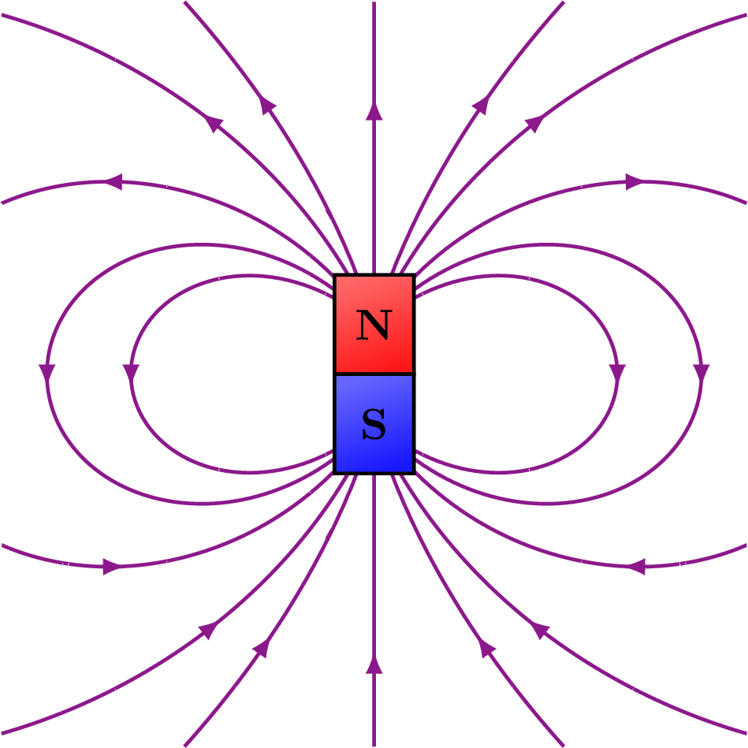

# A Introdução ao Magnetismo: O Giro Invisível

## O Grande Paradoxo do Elétron

Até o momento, a nossa jornada histórica estabeleceu duas propriedades intrínsecas: a **Massa** (que gera gravidade) e a **Carga Elétrica** (que gera a eletrostática). Vimos que o elétron é o operador microscópico da eletricidade; ele é um monopolo elétrico, uma carguinha isolada negativa.

Porém, se analisarmos a matéria com cuidado, percebemos uma anomalia. Alguns materiais na natureza, como a magnetita, interagem entre si à distância através de uma força diferente, que atrai ou repele sem precisar trocar choques elétricos. Chamamos isso de **Magnetismo**.

Se a eletricidade vem da carga do elétron, de onde vem o magnetismo?

A resposta clássica que a maioria dos livros dá é: _"o magnetismo surge quando uma carga elétrica se move"_. Embora isso seja verdade para fios condutores (correntes elétricas), isso falha terrivelmente em explicar por que um ímã de geladeira, que está parado sobre a mesa, consegue puxar um clipe de papel. Onde está o movimento ali?

Para desvendar esse mistério, precisamos voltar para dentro do átomo e olhar novamente para o elétron. Descobriremos que ele esconde uma terceira propriedade intrínseca, ainda mais abstrata que as duas primeiras.

## O Spin: O Micro-Ímã Fundamental

Quando Niels Bohr e os físicos quânticos mapearam a eletrosfera, eles perceberam que os elétrons possuíam um tipo estranho de momento angular — uma energia de rotação.

Para salvar a intuição humana, os cientistas criaram uma analogia mecânica: imaginaram o elétron como uma bolinha carregada girando em torno do próprio eixo, como um pião ou como a Terra no movimento de rotação.

Pense na mecânica dessa imagem: se o elétron é uma esfera carregada e ele gira, a sua carga elétrica está em movimento circular. Uma carga andando em círculos é, por definição, uma micro-corrente elétrica em loop. E como toda corrente em loop gera um campo que atravessa o centro do círculo, essa bolinha girando se transforma, inevitavelmente, em um **minúsculo ímã permanente**, dotado de um polo Norte e um polo Sul.

A esse "giro" intrínseco, a física deu o nome de **Spin** (que significa girar, em inglês).

> **A Quebra de Paradigma Moderna:** Hoje, a física de semicondutores sabe que o elétron é uma partícula pontual; ele não tem superfície física e não está "girando de verdade" (se estivesse, sua superfície superaria a velocidade da luz). O Spin é, na verdade, uma propriedade quântica pura. O elétron simplesmente _nasceu_ sendo um **Dipolo Magnético**. Não existem monopolos magnéticos no universo; você nunca encontrará um polo Norte ou um polo Sul isolados. O elétron é a menor unidade de ímã que existe.

### A Dança dos Elétrons: Por que nem tudo é Ímã?

Se cada elétron do universo é um mini-ímã, por que este texto que você lê agora, o seu computador, ou uma colher de prata não saem grudando em todas as superfícies metálicas? Por que o magnetismo parece ser um privilégio de poucos materiais?

A resposta reside na organização dos orbitais atômicos através de duas regras da mecânica quântica:

- **O Princípio da Exclusão de Pauli:** dita que cada orbital (que podemos imaginar como uma "caixa" espacial) só suporta, no máximo, dois elétrons. Se houver dois, eles obrigatoriamente devem ter spins opostos: um para cima ($\uparrow$) e outro para baixo ($\downarrow$). Quando emparelhados, o polo Norte de um cancela o polo Sul do outro, resultando em um efeito magnético nulo.
    
- **A Regra de Hund:** dita que, ao preencher um subnível (como os orbitais $d$ ou $p$), os elétrons são "antissociais". Eles vão se posicionar primeiro **sozinhos em cada caixa, todos com o mesmo spin ($\uparrow$)**, e somente depois começarão a se emparelhar se não houver outra caixa vazia.
    

A forma como essa distribuição de spins se organiza na matéria é o que define as três grandes classificações magnéticas:

#### Materiais Diamagnéticos

- **São materiais onde todos os elétrons estão rigidamente emparelhados** em seus orbitais. Não há nenhum spin "sozinho" para gerar magnetismo líquido no átomo. Quando expostos a um campo magnético externo, seus orbitais sofrem uma leve distorção quântica que gera uma força contrária ao campo (Lei de Lenz). Eles sofrem uma repulsão tão ridiculamente fraca que, na engenharia do dia a dia, dizemos que eles não sentem nada.
- **A Química por trás (O Exemplo do Cobre):** O Cobre ($Z=29$) termina sua configuração em $3d^{10} 4s^1$. Se olharmos para o subnível $d$ (que possui 5 orbitais), todos os 10 elétrons preenchem as caixas em pares perfeitos, cancelando-se mutuamente:
    

|**Orbital d1​**|**Orbital d2​**|**Orbital d3​**|**Orbital d4​**|**Orbital d5​**|
|---|---|---|---|---|
|$\uparrow\downarrow$|$\uparrow\downarrow$|$\uparrow\downarrow$|$\uparrow\downarrow$|$\uparrow\downarrow$|

#### Materiais Paramagnéticos

- São materiais que **possuem elétrons desemparelhados**, ou seja, existem spins sozinhos gerando magnetismo em cada átomo. No entanto, em uma peça macroscópica desse material, a agitação térmica chacoalha os átomos continuamente, fazendo com que cada um desses micro-ímãs aponte para uma direção aleatória no espaço. O efeito médio é nulo. Se você aproximar um ímã forte, eles se alinham timidamente, sofrendo uma atração muito sutil que desaparece assim que o ímã se afasta.
- **A Química por trás (O Exemplo do Alumínio):** O Alumínio ($Z=13$) tem sua camada de valência terminando em $3s^2 3p^1$. O subnível $p$ possui 3 orbitais e, pela Regra de Hund, o único elétron disponível fica isolado em sua própria caixa, gerando um pequeno momento magnético que acaba perdido no caos térmico:
    

|**Orbital p1​**|**Orbital p2​**|**Orbital p3​**|
|---|---|---|
|$\uparrow$|$\quad$|$\quad$|

#### Materiais Ferromagnéticos

- É a elite do magnetismo. São materiais que não apenas possuem elétrons desemparelhados, mas também exibem uma propriedade chamada _interação de troca_. Os átomos vizinhos cooperam fortemente entre si, travando seus spins na mesma direção e criando regiões magnéticas macroscópicas alinhadas chamadas **Domínios Magnéticos**. Quando um ímã chega perto, ele força todos esses domínios a se alinharem instantaneamente com ele, gerando uma força de atração violenta.
- **A Mecânica da Geladeira:** É por isso que o ímã gruda na porta de aço da geladeira. O campo do ímã alinha os domínios do aço na mesma direção, criando uma atração forte (Força Normal). Essa compressão gera o atrito necessário na vertical para vencer a força gravitacional e impedir que o ímã caia.
- **A Química por trás (O Exemplo do Ferro):** O Ferro ($Z=26$) termina em $3d^6 4s^2$. Aplicando a Regra de Hund no subnível $d$, colocamos primeiro um elétron para cima em cada uma das 5 caixas e o 6º elétron emparelha para baixo na primeira caixa:
    

|**Orbital d1​**|**Orbital d2​**|**Orbital d3​**|**Orbital d4​**|**Orbital d5​**|
|---|---|---|---|---|
|$\uparrow\downarrow$|$\uparrow$|$\uparrow$|$\uparrow$|$\uparrow$|

Graças à Regra de Hund, o Ferro termina com **4 elétrons desalinhados e apontando para o mesmo sentido ($\uparrow\uparrow\uparrow\uparrow$)**, o que explica a sua absurda afinidade magnética.

## A Anatomia do Dipolo: Por que as Linhas de Força Giram?

Agora que entendemos que o elétron é a menor unidade magnética do universo e que ele é um **dipolo**, precisamos observar como isso altera a geometria do espaço.

Na eletrostática, a vida era simples. Uma carga positiva isolada (monopolo) cuspia linhas de campo elétrico que viajavam em linha reta até o infinito. As linhas tinham um começo (fonte) e um fim (sumidouro).

No magnetismo, como todo operador microscópico tem um Norte e um Sul grudados de forma indissociável, as linhas de campo magnético ($\vec{B}$) são obrigadas a fazer um caminho de retorno. Elas saem do polo Norte, curvam-se pelo espaço e entram no polo Sul, **fechando-se em loops contínuos**.

Se você quebrar um ímã ao meio na tentativa de isolar o Norte do Sul, os domínios magnéticos nas bordas da fratura se reorganizam instantaneamente, criando dois novos ímãs, cada um com seu próprio Norte e Sul.

Essa natureza dipolar impõe uma lei geométrica implacável: **as linhas de campo magnético nunca se cruzam e nunca terminam.** Se você desenhar uma superfície fechada em volta de qualquer material magnético, o número de linhas que sai (Norte) é rigorosamente igual ao número de linhas que entra (Sul).

Matematicamente, isso significa que a divergência do campo magnético é zero ($\vec{\nabla} \cdot \vec{B} = 0$), uma das famosas Equações de Maxwell que dita a inexistência de monopolos magnéticos.

## O Ápice Contemporâneo: Os Supercondutores e o Efeito Meissner

Até agora, vimos materiais que ignoram o magnetismo (diamagnéticos), materiais que se alinham timidamente (paramagnéticos) e materiais que cooperam fortemente (ferromagnéticos). Mas o que acontece se levarmos a engenharia de materiais ao extremo físico? Entramos no reino da **Supercondutividade**.

Descobertos ao resfriar certos materiais a temperaturas próximas ao zero absoluto (ou em ligas modernas sob condições específicas), os supercondutores são conhecidos por conduzirem corrente elétrica com **zero resistência**. Os elétrons param de colidir com a rede atômica e fluem como um fluido perfeito.

Porém, a supercondutividade não é apenas sobre eletricidade perfeita; ela provoca um fenômeno magnético quântico espetacular chamado **Efeito Meissner**.

Quando um material normal entra no estado supercondutor, ele não se torna apenas um diamagnético comum. Ele se transforma em um **diamagnético perfeito**. O material desenvolve uma repulsa tão violenta a campos magnéticos externos que ele simplesmente **expulsa todas as linhas de força magnética de dentro do seu corpo**.

### O Mecanismo Microscópico: Os Pares de Cooper

No zero absoluto, a agitação térmica cessa. Os elétrons do supercondutor se unem em duplas chamadas **Pares de Cooper**. Essa união permite que eles criem micro-correntes superficiais perfeitas e instantâneas quando um ímã se aproxima.

Essas correntes geram um campo magnético interno de oposição que cancela milimetricamente o campo do ímã dentro do material ($B_{\text{interno}} = 0$).

O resultado macroscópico dessa batalha quântica é a **Levitação Magnética**. O ímã flutua estavelmente acima do supercondutor porque o campo magnético não consegue penetrar o material; as linhas de força são forçadas a desviar e contornar o objeto, criando um colchão magnético indestrutível.

## Epílogo: O Próximo Desafio da Engenharia

Compreendida a riqueza microscópica da matéria — desde os spins dos elétrons emparelhados na química até a expulsão perfeita de linhas de força nos supercondutores —, caímos no grande dilema da engenharia prática: **como quantificar e calcular esses campos quando as cargas estão em movimento macroscópico?**

Se quisermos projetar os potentes eletroímãs que resfriam os supercondutores dos trens Maglev, os sensores magnéticos dos computadores quânticos ou simplesmente os motores elétricos do dia a dia, precisamos de uma ferramenta matemática de força bruta. Uma lei que pegue uma geometria de corrente qualquer e nos diga o formato exato desse campo que se recusa a ser radial e teima em girar no espaço.

Essa ferramenta é a chamada **Lei de Biot-Savart**, o assunto do nosso próximo tópico.
