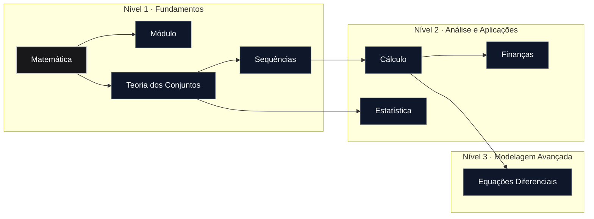

# Domínio de Matemática

> "A Matemática é o alfabeto com o qual Deus escreveu o universo."  
> — **Galileo Galilei**

O domínio de **Matemática** estabelece a linguagem formal, as estruturas abstratas e os métodos rigorosos de raciocínio que fundamentam toda a análise científica, engenharia e modelagem quantitativa do repositório.

Através deste ecossistema, os módulos progridem desde os fundamentos lógicos e algébricos da teoria dos conjuntos e sequências até as ferramentas avançadas de cálculo infinitesimal, equações diferenciais e análise estatística aplicadas a sistemas reais.

