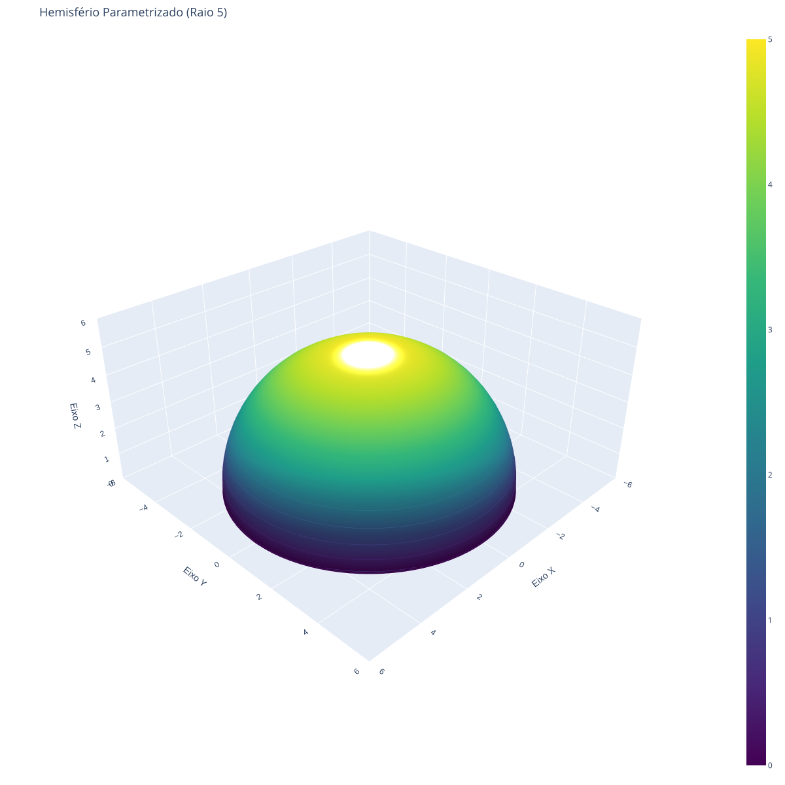

## O Paradigma Multivariável

O cálculo de uma variável real concentra-se na análise de funções da forma $y = f(x)$, em que uma única variável de entrada determina o comportamento de uma variável de saída. Essa abordagem é ideal para modelar sistemas unidimensionais simples, como a posição de um objeto ao longo de uma reta em função do tempo ou o decaimento radioativo de uma substância.

No entanto, a quase totalidade dos fenômenos do mundo real e dos sistemas complexos depende de múltiplas variáveis interdependentes. A pressão de um gás ideal é determinada simultaneamente por sua temperatura e pelo volume do recipiente. O custo de produção de um bem industrial depende do consumo de energia, do custo da matéria-prima e das horas de trabalho empregadas. A altitude de um relevo varia conforme as coordenadas horizontais de latitude e longitude.

O Cálculo Multivariável é a extensão formal da análise matemática para funções que operam sobre espaços de dimensões superiores. Ele estuda o comportamento, a variação local, a otimização e a acumulação de grandezas que dependem de dois ou mais fatores simultâneos.

---

## Funções de Várias Variáveis

Enquanto uma função de uma variável mapeia um subconjunto dos números reais em outro subconjunto real ($f: D \subseteq \mathbb{R} \to \mathbb{R}$), uma função de $n$ variáveis reais mapeia um subconjunto do espaço $n$-dimensional $\mathbb{R}^n$ para o conjunto dos números reais $\mathbb{R}$.

$$\begin{aligned} f: D \subseteq \mathbb{R}^n &\to \mathbb{R} \\ (x_1, x_2, \dots, x_n) &\mapsto y = f(x_1, x_2, \dots, x_n) \end{aligned}$$

Para o caso mais comum em aplicações práticas, com duas variáveis independentes ($n = 2$), escreve-se $z = f(x, y)$. Para três variáveis ($n = 3$), a notação padrão é $w = f(x, y, z)$.

### Domínio e Imagem em Dimensões Superiores

O domínio $D$ de uma função de várias variáveis é o conjunto de todos os pontos ordenados para os quais a expressão matemática está bem definida no espaço $n$-dimensional.

* **Caso $n = 2$:** O domínio $D \subseteq \mathbb{R}^2$ é uma região do plano cartesiano.
* **Caso $n = 3$:** O domínio $D \subseteq \mathbb{R}^3$ é uma região (ou volume) do espaço tridimensional.

A imagem da função é o conjunto de todos os valores reais resultantes de $f(\mathbf{x})$ para cada elemento $\mathbf{x} \in D$.

Por exemplo, considere a função de duas variáveis que modela a altitude de um hemisfério de raio $r = 5\text{ m}$:

$$z = f(x, y) = \sqrt{25 - x^2 - y^2}$$

A restrição matemática exige que o radicando seja não negativo ($25 - x^2 - y^2 \ge 0$), o que define o domínio como o disco fechado de raio $5$ centrado na origem do plano $xy$:

$$D = \{(x, y) \in \mathbb{R}^2 \mid x^2 + y^2 \le 25\}$$

*Figura: Uma prévia tridimensional de f(x, y) = √(25 - x² - y²), ilustrando o comportamento geométrico de funções com restrição de domínio.*

---

## Comparativo: Cálculo Monovariável versus Multivariável

A transição de uma para múltiplas variáveis altera profundamente os conceitos fundamentais de diferenciação, integração e limites. A tabela a seguir sintetiza as diferenças estruturais entre esses dois paradigmas:

| Conceito Fundamental | Cálculo Monovariável ($1\text{D}$) | Cálculo Multivariável ($n\text{D}$) |
| :--- | :--- | :--- |
| **Domínio de Definição** | Intervalos na reta real ($\mathbb{R}$) | Regiões no plano ($\mathbb{R}^2$) ou espaço ($\mathbb{R}^3$) |
| **Representação Gráfica** | Curva em um plano $2\text{D}$ ($y = f(x)$) | Superfície no espaço $3\text{D}$ ($z = f(x,y)$) ou hiper-superfície |
| **Aproximação Local** | Reta tangente em um ponto | Plano tangente em um ponto ou hiperplano |
| **Caminhos de Aproximação (Limites)** | Apenas duas direções (pela esquerda e pela direita) | Infinitos caminhos e curvas possíveis contidos no domínio |
| **Taxa de Variação (Derivada)** | Derivada única $f'(x)$ representando a inclinação | Derivadas parciais e gradiente $\nabla f$ indicando direção de máxima variação |
| **Acumulação (Integração)** | Área sob a curva em um intervalo $[a, b]$ | Volume sob a superfície em uma região $D$ (Integrais Múltiplas) |

---

## Representação Visual e Visualização de Dados

Um dos desafios centrais do Cálculo Multivariável é a visualização de funções. Para funções de duas variáveis $z = f(x, y)$, o gráfico é a superfície no espaço composta por todos os pontos $(x, y, f(x, y))$ em que $(x, y) \in D$.

Quando a função possui três ou mais variáveis ($w = f(x, y, z)$), seu gráfico habita um espaço de quatro dimensões ($\mathbb{R}^4$), o que impossibilita a visualização geométrica direta. Para contornar essa limitação, utilizam-se técnicas de redução dimensional:

### Curvas e Superfícies de Nível

Uma **curva de nível** de uma função $z = f(x, y)$ é o conjunto de pontos no plano $xy$ para os quais a função assume um valor constante $k \in \mathbb{R}$:

$$f(x, y) = k$$

O conjunto de várias curvas de nível desenhadas no mesmo plano gera um **mapa de contorno**. Essa técnica é equivalente às curvas de nível topográficas utilizadas em cartografia para indicar regiões de mesma altitude, ou às isotermas em mapas meteorológicos para indicar regiões de mesma temperatura.

Para funções de três variáveis $w = f(x, y, z)$, a constante $k$ define uma **superfície de nível** no espaço tridimensional:

$$f(x, y, z) = k$$

A análise de superfícies de nível permite interpretar o comportamento de campos escalares em $3\text{D}$, como a distribuição de potencial elétrico em torno de uma carga ou o gradiente de temperatura no interior de um bloco sólido.