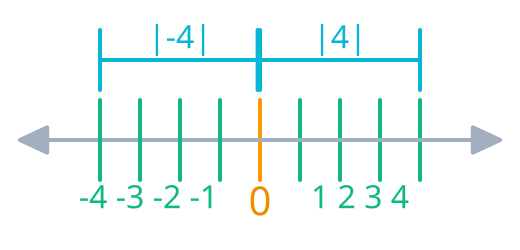
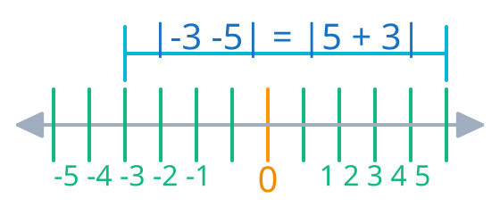

## A Ideia por Trás da Grandeza: Módulo como Distância

Quando você caminha $5$ metros para a frente, percorreu uma distância de $5$ metros. Se der meia-volta e caminhar $5$ metros para trás, a distância percorrida continuará sendo de $5$ metros. A física e a geometria não conhecem "distâncias negativas" — o sentido do deslocamento pode mudar, mas a extensão do espaço percorrido é sempre um valor não-negativo.

O **valor absoluto** (ou **módulo**) nasce dessa necessidade simples: extrair a **magnitude geométrica** de um número, ignorando para qual lado da reta numérica ele aponta. Ele mede a distância física entre um ponto e a origem ($0$).

Visualmente, a ideia é imediata:

* O ponto $4$ está a $4$ unidades do zero $\implies |4| = 4$
* O ponto $-4$ também está a $4$ unidades do zero $\implies |-4| = 4$
* A própria origem $0$ está a distância zero de si mesma $\implies |0| = 0$

Quando avaliamos expressões mais elaboradas, o raciocínio permanece o mesmo:

* $|7| = 7$, pois a magnitude até a origem é $7$.
* $|-12| = 12$, pois o deslocamento absoluto é de $12$ unidades.
* $|\pi - 3| = \pi - 3$, porque como $\pi \approx 3,14$, a diferença já é positiva.
* $|3 - \pi| = \pi - 3$, pois como $3 - \pi$ resulta em um valor negativo, inverter a ordem da subtração garante a distância positiva real.

---

## Medindo o Espaço Entre Dois Pontos

Se o módulo mede a distância até a origem, podemos expandir essa mesma ideia para calcular o espaço entre **quaisquer dois pontos** $a$ e $b$ na reta real:

$$d(a, b) = |a - b|$$

Note como a matemática reflete a realidade: a distância entre duas cidades não muda se você vai ou se você volta. A ordem em que você subtrai os pontos não altera a extensão do espaço percorrido:

* **De $-3$ até $5$:** caminhamos $3$ unidades até o zero e mais $5$ unidades adiante, totalizando $8$ unidades.
  $$|-3 - 5| = |-8| = 8$$

* **De $5$ até $-3$:** 
  $$|5 - (-3)| = |5 + 3| = |8| = 8$$

A igualdade $|a - b| = |b - a|$ é a prova algébrica dessa simetria natural.

---

## Definição Algébrica

Para resolver equações e programar sem precisar desenhar retas a todo momento, traduzimos essa ideia geométrica em uma **função definida por partes**:

Para qualquer número real $x$:

$$|x| = \begin{cases} x, & \text{se } x \ge 0 \\ -x, & \text{se } x < 0 \end{cases}$$

### Desfazendo um Nó Mental Comum: O Papel de $-x$

Ao olhar para a expressão $-x$, nosso cérebro costuma associar o sinal de menos a um número negativo. Mas na álgebra, o sinal de menos é um **operador de inversão** — ele significa "o oposto de".

* Se a entrada já é positiva ou zero ($x = 5$), a função mantém o número como está: $|5| = 5$.
* Se a entrada é negativa ($x = -5$), a função aplica o operador de inversão para neutralizar a polaridade original:
  $$|-5| = -(-5) = 5$$

A expressão $-x$ não torna o resultado negativo. Pelo contrário: ela é a ferramenta exata que neutraliza o sinal negativo da entrada, garantindo que a saída pertença sempre ao conjunto dos números não-negativos ($\mathbb{R}_{\ge 0}$).

### Aplicando a Regra na Prática: A Remoção do Módulo

O objetivo da definição algébrica é nos dar um mecanismo rigoroso para **remover as barras do módulo** e trabalhar apenas com a álgebra comum. Para isso, analisamos se a expressão interna é não-negativa ou negativa.

#### Avaliando Constantes e Relações de Ordem

Quando os valores são conhecidos, a decisão de manter a expressão ou inverter seus sinais depende diretamente de qual termo é maior:

* **Em $|\sqrt{2} - 1|$:** Como $\sqrt{2} \approx 1{,}414 > 1$, o termo interno é positivo ($\sqrt{2} - 1 > 0$). A regra mantém a expressão intacta:
  $$|\sqrt{2} - 1| = \sqrt{2} - 1$$

* **Em $|1 - \sqrt{2}|$:** Como $1 < \sqrt{2}$, o termo interno é negativo ($1 - \sqrt{2} < 0$). A regra aplica o operador de inversão em toda a expressão:
  $$|1 - \sqrt{2}| = -(1 - \sqrt{2}) = \sqrt{2} - 1$$

É exatamente esse mecanismo que garante algebricamente que $|a - b| = |b - a|$ para quaisquer valores reais.

#### Expressões Algébricas e Troca de Sinal

Ao lidar com variáveis em equações ou programas, a remoção das barras de módulo exige analisar o domínio do argumento:

Para a expressão $|x - 3|$:

* **Quando $x \ge 3$:** A diferença $x - 3$ produz um valor não-negativo. O módulo é simplesmente removido:
  $$|x - 3| = x - 3$$

* **Quando $x < 3$:** A diferença $x - 3$ resulta em um valor negativo. O módulo é removido aplicando-se a inversão de sinal a toda a estrutura:
  $$|x - 3| = -(x - 3) = 3 - x$$

Toda a resolução de equações e inequações modulares se resume a este processo: identificar o sinal do argumento para substituir o módulo pela sua forma algébrica equivalente.

> [!NOTE]
> 
> Perceba que, em equações envolvendo o módulo, é necessário analisar o intervalo e avaliar o conteúdo interno:
>
>- Se $\text{conteúdo} \ge 0$, a expressão já representa um valor no intervalo dos números não-negativos da reta real.
  >  
>- Se $\text{conteúdo} < 0$, significa que a expressão interna é negativa. Por isso, multiplicamos por $-1$ (pois só existe distância positiva), invertendo a polaridade para o intervalo positivo.
  >  
>A definição algébrica serve justamente para garantir que, conhecendo-se ou não o valor do conteúdo interno, o resultado final da operação de módulo seja sempre uma magnitude geométrica (distância), que por natureza é sempre não-negativa.

---

## Por Que a Matemática Garante que Isso Sempre Funciona?

A definição por partes não é um truque arbitrário; ela decorre da própria estrutura lógica dos números reais $(\mathbb{R}, +, \cdot, \le)$. 

Existe uma propriedade fundamental nos números reais chamada **Lei da Tricotomia**. Ela estabelece que qualquer número real $x$ pertence obrigatoriamente a uma — e apenas uma — destas três possibilidades:

$$x > 0 \quad \lor \quad x = 0 \quad \lor \quad x < 0$$

Como a reta real está perfeitamente dividida nesses três grupos sem nenhuma sobreposição, a regra do módulo nunca falha nem gera ambiguidades.

Além disso, quando $x < 0$, a álgebra nos mostra por que $-x$ torna-se estritamente positivo: ao somarmos o inverso aditivo $-x$ em ambos os lados da desigualdade $x < 0$, obtemos:

$$x + (-x) < 0 + (-x) \implies 0 < -x \implies -x > 0$$

Isso prova com rigor dedutivo que o oposto de qualquer elemento negativo é um valor estritamente positivo.