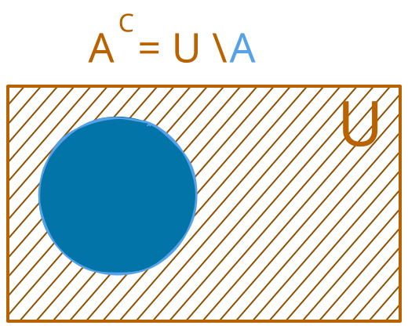

# Teoria Operacional e Álgebra de Conjuntos

## Da Fundação Axiomática à Linguagem Prática
No capítulo anterior, exploramos os bastidores da matemática: os axiomas da Teoria de Conjuntos (ZFC) que garantem que o sistema não colapse em contradições. Porém, assim como não precisamos calcular a mecânica quântica para usar um computador, não precisamos manipular axiomas para usar conjuntos na prática.

Com a garantia de que o sistema é seguro, podemos avançar para a linguagem visível da matemática. O conceito fundamental de Conjunto é intuitivo: é qualquer coleção bem definida de objetos, chamados de elementos.

---

## O Conceito e a Notação de Conjuntos
Para evitar ambiguidades ao comunicar ideias matemáticas, estabelece-se uma notação universal rígida para representar conjuntos e seus elementos.

### Convenções de Notação
* **Conjuntos:** São representados por letras maiúsculas do alfabeto ($A, B, C, \dots, X, Y, Z$).
* **Elementos:** São representados por letras minúsculas ($a, b, c, \dots, x, y, z$).
* **Agrupamento:** Os elementos de um conjunto são sempre delimitados por chaves ($\{\dots\}$) e separados por vírgulas.

### As Duas Formas de Declarar um Conjunto
Existem duas maneiras universais de definir quais elementos fazem parte de uma coleção.

#### Declaração por Extensão (Listagem Explícita)
Os elementos são individualmente listados dentro das chaves. Esta forma é ideal para conjuntos finitos e pequenos.
$$A = \{2, 4, 6, 8\}$$

#### Declaração por Compreensão (Filtro Lógico)
Em vez de listar elemento por elemento, define-se uma propriedade ou condição de filtro $P(x)$ que todo elemento $x$ deve satisfazer para pertencer ao conjunto. Utiliza-se a barra vertical ($\mid$) ou dois pontos ($:$) para significar "tal que".
$$A = \{x \in \mathbb{N} \mid x \text{ é par e } 0 < x < 10\}$$

A leitura dessa notação é: *"A é o conjunto de todos os elementos x pertencentes aos números naturais tais que x é par e está estritamente entre 0 e 10"*.

---

## Relações Fundamentais: Pertinência e Inclusão
A teoria dos conjuntos estabelece duas relações distintas: a relação de um objeto com uma coleção (pertinência) e a relação entre duas coleções (inclusão).

### Relação de Pertinência ($\in$ e $\notin$)
A pertinência associa um elemento individual a um conjunto.

* **Pertence ($\in$):** O elemento faz parte do conjunto.
  $$x \in A$$
* **Não Pertence ($\notin$):** O elemento não faz parte do conjunto.
  $$y \notin A$$

**Exemplo:**
Dado o conjunto $A = \{2, 4, 6\}$:
* $2 \in A$
* $3 \notin A$

**Cuidados:**
* A pertinência relaciona estritamente um elemento a um conjunto.
* O símbolo $\in$ não deve ser utilizado para relacionar dois conjuntos diretamente entre si, salvo no caso específico em que um conjunto é elemento de outro (como no Conjunto das Partes).

### O Conceito Formal de Subconjunto
Um conjunto $A$ é denominado subconjunto de $B$ se, e somente se, todos os elementos de $A$ pertencerem também a $B$.
A inclusão exige a totalidade dos elementos de $A$. Se existir ao menos um único elemento em $A$ que não pertença a $B$, a relação $A \subseteq B$ é falsa.

### Relação de Inclusão ($\subseteq, \subsetneq, \supseteq, \nsubseteq$)
A inclusão estabelece a relação de um subconjunto com o conjunto que o contém.
$$A \subseteq B \iff (\forall x)(x \in A \implies x \in B)$$

#### Símbolos e Leituras
* **Subconjunto / Contido ($\subseteq$):** $A \subseteq B$ ($A$ está contido em $B$). Garante que todo elemento de $A$ está em $B$, admitindo a igualdade ($A = B$).
* **Subconjunto Próprio ($\subset$ ou $\subsetneq$):** $A \subsetneq B$ ($A$ está contido propriamente em $B$). Exige que todos os elementos de $A$ pertençam a $B$ E que $B$ possua ao menos um elemento que não pertence a $A$ ($A \neq B$).
* **Não Contido ($\nsubseteq$):** $A \nsubseteq B$ (existe ao menos um elemento em $A$ que não pertence a $B$).
* **Contém ($\supseteq$):** $B \supseteq A$ ($B$ contém o conjunto $A$).

#### Distinção Crucial: Subconjunto ($\subseteq$) vs. Subconjunto Próprio ($\subsetneq$)
A relação de inclusão é análoga às comparações numéricas:
* $\subseteq$ funciona como $\le$ (menor ou igual): Permite que os conjuntos sejam idênticos.
* $\subsetneq$ funciona como $<$ (estritamente menor): Exige que o primeiro conjunto seja estritamente menor e diferente do segundo.

#### O Caso da Igualdade e da Auto-Inclusão ($A = B$)
Como a definição de subconjunto ($\subseteq$) admite a igualdade:
* **Todo conjunto é subconjunto de si mesmo:** $A \subseteq A$ é sempre verdadeiro.
* **Se $A = B$:** A afirmação $A \subseteq B$ é verdadeira, pois todos os elementos de $A$ estão em $B$. No entanto, a afirmação $A \subsetneq B$ é falsa, pois não há elemento exclusivo em $B$.

#### Exemplo Prático
Dados os conjuntos $A = \{1, 2\}$, $B = \{1, 2, 3\}$, $C = \{3, 4\}$ e $D = \{1, 2\}$:
* $A \subseteq B$ (pois todos os elementos de $A$, $1$ e $2$, pertencem a $B$).
* $A \subsetneq B$ (pois $A \subseteq B$ e o elemento $3 \in B$ não pertence a $A$).
* $A \subseteq D$ (verdadeiro, pois $A = D$).
* $A \subsetneq D$ (falso, pois $A = D$).
* $C \nsubseteq B$ (pois, embora $3 \in C$ pertença a $B$, o elemento $4 \in C$ não pertence a $B$).

#### Cuidados Formais
* **Exigência da Totalidade:** A presença de apenas alguns elementos de um conjunto dentro do outro não valida a inclusão. Apenas a totalidade dos elementos garante a relação $A \subseteq B$.
* **Distinção Estrutural (Elemento vs. Conjunto):** O elemento $2$ e o conjunto unitário $\{2\}$ são objetos matemáticos distintos. Para $A = \{2, 4\}$, a forma correta é $2 \in A$ e $\{2\} \subseteq A$. Escrever $2 \subseteq A$ ou $\{2\} \in A$ constitui erro formal.
* **O Conjunto Vazio:** O conjunto vazio ($\emptyset$) é subconjunto de qualquer conjunto ($\emptyset \subseteq A, \forall A$), pois a condição "todo elemento de $\emptyset$ pertence a $A$" é vacuamente verdadeira.
* **Reflexividade:** Todo conjunto é subconjunto (impróprio) de si mesmo ($A \subseteq A$).

---

## As Operações Fundamentais
As operações de conjuntos funcionam como os operadores aritméticos das coleções, permitindo criar novos conjuntos a partir de grupos existentes.

### União ($A \cup B$) — O OU Lógico ($\lor$)

Combina todos os elementos pertencentes a $A$, a $B$ ou a ambos em uma única coleção.
$$A \cup B = \{x \mid x \in A \lor x \in B\}$$

* **Conexão Lógica ($\lor$):** O símbolo da união ($\cup$) reflete diretamente o OU lógico ($\lor$). Um elemento entra na união se ele responde "sim" para estar em $A$ OU estar em $B$ (ou em ambos).
* **Exemplo Numérico:** Se $A = \{1, 2, 3\}$ e $B = \{3, 4, 5\}$, então $A \cup B = \{1, 2, 3, 4, 5\}$.
* **Analogia Prática (O Teste da Porta):** Imagine que $A$ é a Lista VIP e $B$ é a Lista de Convidados de uma festa. Para entrar no evento ($A \cup B$), a regra na porta é: *"Você está na Lista A OU na Lista B?"*. Se o Carlos tem o nome nas duas listas, ele responde "Sim!" e ganha acesso. Ele entra na festa como uma única pessoa — estar em duas listas garante o direito de entrar, mas não clona o Carlos dentro do salão.
* **Nota Teórica (Por que elementos repetidos não são contabilizados?):**
  Ao unir $A$ e $B$, o elemento $3$ está presente em ambos os conjuntos. O resultado "bruto" da junção seria a coleção $\{1, 2, 3, 3, 4, 5\}$. No entanto, pelo Axioma da Extensionalidade, dois conjuntos são idênticos se contêm exatamente os mesmos elementos. Como repetir o elemento $3$ não adiciona nenhum novo objeto à coleção, $\{1, 2, 3, 3, 4, 5\}$ e $\{1, 2, 3, 4, 5\}$ são o mesmo conjunto. Por isso, simplificamos e omitimos duplicatas.

### Interseção ($A \cap B$) — O E Lógico ($\land$)

Filtra e preserva exclusivamente os elementos que estão presentes de forma simultânea nos dois conjuntos.
$$A \cap B = \{x \mid x \in A \land x \in B\}$$

* **Conexão Lógica ($\land$):** O símbolo da interseção ($\cap$) reflete diretamente o E lógico ($\land$). Um elemento entra na interseção estritamente se ele estiver em $A$ E estiver em $B$.
* **Exemplo Numérico:** Se $A = \{1, 2, 3\}$ e $B = \{3, 4, 5\}$, então $A \cap B = \{3\}$.
* **Analogia Prática (A Área Restrita):** Imagine agora uma sala exclusiva dentro da festa que exige que a pessoa esteja na Lista VIP E na Lista de Convidados ao mesmo tempo. A Ana (que só está na Lista A) é barrada. O Carlos (presente em ambas) atende à condição e passa. O conjunto da interseção é formado apenas por pessoas na situação do Carlos.

### Diferença ($A \setminus B$) — O NÃO Lógico ($\neg$)

Subtrai do conjunto $A$ todos os elementos que também pertencem ao conjunto $B$.
$$A \setminus B = \{x \mid x \in A \land x \notin B\}$$

* **Conexão Lógica:** Combina a condição de pertencimento E ($\land$) com a negação NÃO ($\notin$).
* **Exemplo Numérico:** Se $A = \{1, 2, 3\}$ e $B = \{3, 4, 5\}$, então $A \setminus B = \{1, 2\}$.
* **Analogia Prática (Filtro de Exclusividade):** O organizador quer saber quem são as pessoas da Lista VIP ($A$) que NÃO estão na Lista de Convidados ($B$). Ele pega a Lista A e risca o nome do Carlos, pois o Carlos também é convidado. Sobram apenas os VIPs exclusivos (como a Ana).

### Complementar ($A^c$) — A Negação Absoluta

Mapeia todos os elementos pertencentes ao universo de trabalho $U$ que não fazem parte do conjunto $A$.
$$A^c = \{x \in U \mid x \notin A\} = U \setminus A$$

* **Exemplo Numérico:** Se o universo de análise é $U = \{1, 2, 3, 4, 5\}$ e $A = \{1, 2\}$, então $A^c = \{3, 4, 5\}$.
* **Analogia Prática (Quem ficou de fora):** Se o Universo $U$ representa todas as pessoas da cidade, o complementar $A^c$ é o grupo de cidadãos que NÃO possuem o nome na Lista VIP.

> **Nota:** O conjunto universo ($U$) varia conforme o contexto do problema. Embora frequentemente seja o conjunto dos Números Reais ($\mathbb{R}$) em análise e finanças, ele pode ser qualquer domínio bem definido — como um conjunto de pessoas, dados de uma tabela ou todo o plano complexo ($\mathbb{C}$).

---

## Visualização Espacial: O Diagrama de Venn

O Diagrama de Venn é a ferramenta gráfica universal utilizada para representar geometricamente as relações e sobreposições entre conjuntos. Cada conjunto é desenhado como uma região limitada por uma curva fechada (geralmente um círculo), enquanto o plano retângulo delimita o conjunto Universo ($U$).

### Mapeamento das Regiões
* **Interseção Tripla** ($A \cap B \cap C$): O centro do diagrama, onde os 3 círculos se sobrepõem simultaneamente.
* **Apenas A** ($A \setminus (B \cup C)$): A região do círculo $A$ que não toca nem em $B$ nem em $C$.
* **Apenas B** ($B \setminus (A \cup C)$): A região do círculo $B$ que não toca nem em $A$ nem em $C$.
* **Apenas C** ($C \setminus (A \cup B)$): A região exclusiva do círculo $C$.
* **Interseção Apenas entre A e B** ($(A \cap B) \setminus C$): A região onde $A$ e $B$ se cruzam, mas fora do círculo $C$.
* **União** ($A \cup B \cup C$): A área total coberta pelos três círculos juntos.

---

## Simplificação Lógica: As Leis de De Morgan
As Leis de De Morgan são duas regras fundamentais que descrevem a interação entre a negação (o operador Complementar) e as operações de União e Interseção. Elas permitem reescrever e simplificar condições complexas.

### Primeira Lei: Complementar da União
O complementar da união entre dois conjuntos é equivalente à interseção dos seus respectivos complementares.
$$(A \cup B)^c = A^c \cap B^c$$

* **Aplicação Prática:** A negação da condição *"A pessoa mora em São Paulo OU é Cliente Premium"* equivale a exigir que *"A pessoa NÃO mora em São Paulo E NÃO é Cliente Premium"*.

### Segunda Lei: Complementar da Interseção
O complementar da interseção entre dois conjuntos é equivalente à união dos seus respectivos complementares.
$$(A \cap B)^c = A^c \cup B^c$$

* **Aplicação Prática:** A negação da condição *"A pessoa é Médica E Engenheira"* equivale a aceitar que *"A pessoa NÃO é Médica OU NÃO é Engenheira"*.

---

## O Conjunto das Partes e a Análise Combinatória
O Conjunto das Partes de $A$, denotado por $\mathcal{P}(A)$, representa a coleção formada por todos os subconjuntos possíveis extraídos de $A$, incluindo o conjunto vazio ($\emptyset$) e o próprio conjunto $A$.

### Exemplo
Dado o conjunto de escolhas $A = \{\text{Opção 1}, \text{Opção 2}\}$:
* Subconjunto sem escolhas: $\emptyset$
* Subconjuntos unitários: $\{\text{Opção 1}\}$ e $\{\text{Opção 2}\}$
* Subconjunto com todas as escolhas: $\{\text{Opção 1}, \text{Opção 2}\}$

A estrutura completa resulta em:
$$\mathcal{P}(A) = \{\emptyset, \{\text{Opção 1}\}, \{\text{Opção 2}\}, \{\text{Opção 1}, \text{Opção 2}\}\}$$

### Cálculo de Cardinalidade
Para qualquer conjunto finito contendo $n$ elementos, o número total de subconjuntos possíveis cresce em taxa exponencial de base 2:
$$|\mathcal{P}(A)| = 2^n$$

---

## Resumo Operacional
A Álgebra de Conjuntos transforma a lógica descritiva em um cálculo operacional eficiente. O domínio da notação, das operações ($\cup, \cap, \setminus, c$), somado à capacidade de visualização gráfica pelos Diagramas de Venn e de simplificação pelas Leis de De Morgan, consolida a base necessária para a modelagem de dados, probabilidade e lógica analítica.