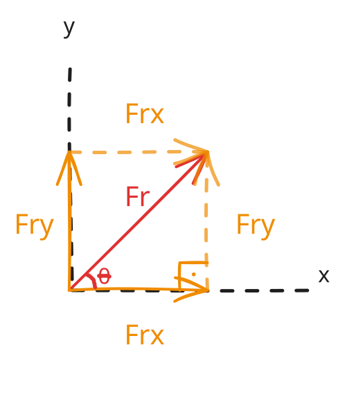
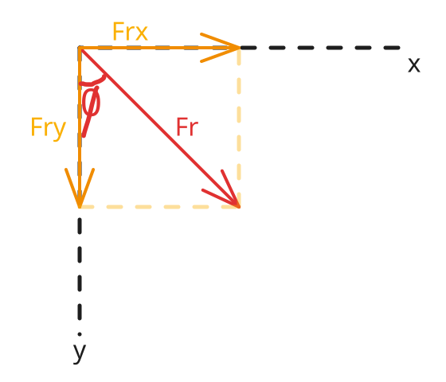

# Compreendendo a Decomposição Vetorial

Embora métodos geométricos como a Regra do Paralelogramo e a Regra da Poligonal sejam intuitivos para combinar poucas forças, a complexidade gráfica escala rapidamente ao avaliar sistemas concorrentes com múltiplas forças. A **decomposição** (ou resolução) vetorial resolve essa limitação projetando uma única força diagonal em componentes escalares ortogonais ao longo de eixos de referência.

---

## Motivação e Definição Formal

Considere uma força de tração diagonal aplicada a uma mala de viagem com rodas. Fisicamente, essa força única induz dois efeitos simultâneos: a translação horizontal ao longo do solo e o alívio vertical da força normal.

Decompor um vetor consiste em traduzir uma força inclinada $\vec{F}$ em duas forças componentes mutuamente perpendiculares—uma ao longo do eixo horizontal ($\vec{F}_x$) e outra ao longo do eixo vertical ($\vec{F}_y$)—cuja soma vetorial é equivalente à força original:

$$\vec{F} = \vec{F}_x + \vec{F}_y$$

---

## Classificação e Casos Limite

### Dependência do Ângulo de Referência

A expressão trigonométrica atribuída a cada componente depende estritamente da orientação geométrica do ângulo de referência $\theta$ em relação aos eixos coordenados:

- **Ângulo em relação ao Eixo Horizontal:** A componente horizontal é adjacente ao ângulo ($\cos$), e a componente vertical é oposta ($\sin$).
- **Ângulo em relação ao Eixo Vertical:** A componente vertical é adjacente ao ângulo ($\cos$), e a componente horizontal é oposta ($\sin$).

| Posição do Ângulo de Referência | Componente Horizontal ($F_x$) | Componente Vertical ($F_y$) |
| :--- | :---: | :---: |
| **Medido a partir do Eixo Horizontal ($x$)** | $F_x = F \cdot \cos(\theta)$ | $F_y = F \cdot \sin(\theta)$ |
| **Medido a partir do Eixo Vertical ($y$)** | $F_x = F \cdot \sin(\phi)$ | $F_y = F \cdot \cos(\phi)$ |

---

## Demonstração e Formulação Matemática

### Dedução Trigonométrica no Plano Cartesiano

Dado um vetor força $\vec{F}$ que forma um triângulo retângulo com as suas projeções no plano cartesiano:

1. **Caso Padrão (Ângulo $\theta$ com o eixo $x$):**

Utilizando as razões trigonométricas fundamentais:

$$\cos(\theta) = \frac{F_x}{F} \implies F_x = F \cdot \cos(\theta)$$

$$\sin(\theta) = \frac{F_y}{F} \implies F_y = F \cdot \sin(\theta)$$

2. **Caso Invertido (Ângulo $\phi$ com o eixo $y$):**

Quando o ângulo $\phi$ é especificado em relação ao eixo vertical, o cateto adjacente corresponde a $F_y$ e o cateto oposto corresponde a $F_x$:

$$\cos(\phi) = \frac{F_y}{F} \implies F_y = F \cdot \cos(\phi)$$

$$\sin(\phi) = \frac{F_x}{F} \implies F_x = F \cdot \sin(\phi)$$

---

## Aplicação Prática e Caso Resolvido

### Representação por Vetores Unitários e Equipolência

Para expressar vetores decompostos algebricamente sem depender de diagramas, definem-se vetores unitários adimensionais $\hat{i}$ e $\hat{j}$ (ou $\vec{i}$ e $\vec{j}$) ao longo dos eixos positivos $x$ e $y$, respetivamente, com magnitude $\|\hat{i}\| = \|\hat{j}\| = 1$.

A representação vetorial cartesiana completa é formulada como:

$$\vec{F} = F_x \hat{i} + F_y \hat{j}$$

> [!NOTE]
> **Equipolência:** As componentes $F_x \hat{i}$ e $F_y \hat{j}$ representam vetores livres equipolentes. Eles possuem magnitude, direção e sentido idênticos, independentemente do ponto de aplicação no corpo rígido.

---

### Armadilha Conceitual: Memorização Cega das Projeções nos Eixos

Um erro frequente é assumir que a componente no eixo $x$ utiliza sempre a função cosseno ($F_x = F \cos\theta$) e a componente no eixo $y$ utiliza sempre a função seno ($F_y = F \sin\theta$).

$$\text{Incorreto (quando o ângulo é vertical): } F_x = F \cdot \cos(\phi)$$

#### Desconstrução

O cosseno está estritamente associado ao **cateto adjacente** do triângulo retângulo de referência, e não ao eixo espacial horizontal. Se o ângulo de referência for medido em relação à linha vertical, a componente adjacente passa a ser $F_y$, fazendo com que $F_x$ dependa de $\sin(\phi)$.

---

## Conexões e Aplicações Avançadas

> [!TIP]
> **Aplicações Computacionais:** A decomposição vetorial cartesiana é essencial para simulações de dinâmica multicorpos e análise de elementos finitos (FEA). Ao converter interações vetoriais diagonais em sistemas escalares ortogonais independentes ($\sum F_x = m a_x$ e $\sum F_y = m a_y$), problemas complexos de mecânica em 2D e 3D tornam-se algebricamente solúveis por algoritmos.