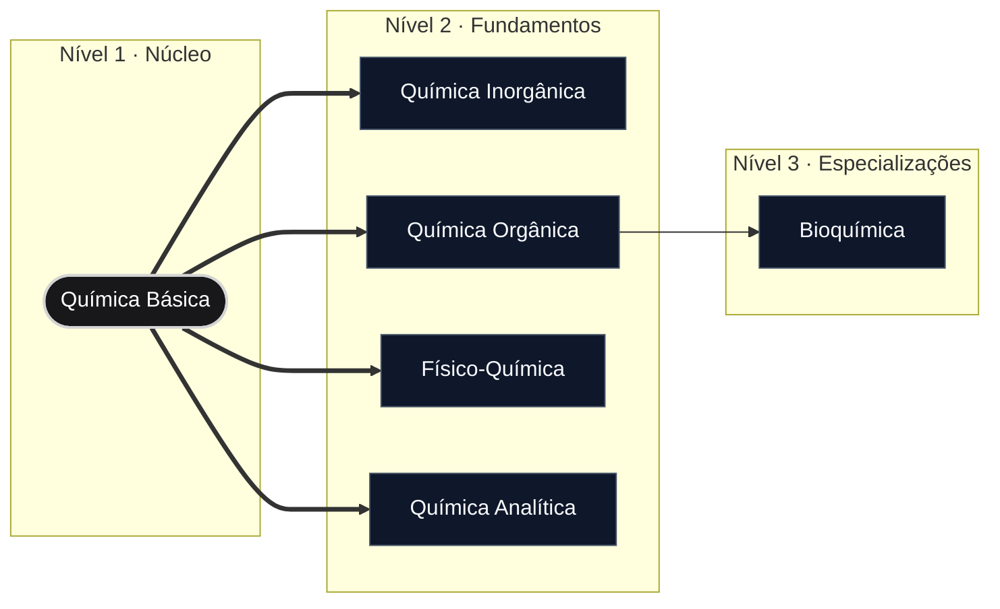

# Domínio de Química Geral

> "Nada na vida deve ser temido, apenas compreendido. Agora é a hora de compreender mais, para que possamos temer menos." — Marie Curie

## Visão Geral

Este domínio serve como o ponto de entrada principal para o estudo da ciência química. Ele organiza os princípios químicos fundamentais em módulos de aprendizagem estruturados, cobrindo desde a estrutura atômica básica até disciplinas avançadas e especializadas.

## Roteiro do Domínio

## Módulos

| Módulo                                     | Descrição                                                                      | Nível         | Status         |
| :----------------------------------------- | :----------------------------------------------------------------------------- | :------------ | :------------- |
| [Química Básica](quimica-basica/README.md) | Princípios fundamentais, teoria atômica, estados da matéria e estequiometria.  | Iniciante     | **Disponível** |
| Química Inorgânica                         | Estudo de compostos inorgânicos, metais de transição e química de coordenação. | Intermediário | *Planejado*    |
| Química Orgânica                           | Química baseada em carbono, grupos funcionais, mecanismos de reação e síntese. | Intermediário | *Planejado*    |
| Físico-Química                             | Termodinâmica química, cinética, mecânica quântica e eletroquímica.            | Avançado      | *Planejado*    |
| Química Analítica                          | Métodos de análise qualitativa e quantitativa, titulometria e espectrometria.  | Avançado      | *Planejado*    |
| Bioquímica                                 | Processos químicos dentro e relacionados a organismos vivos.                   | Avançado      | *Planejado*    |

## Pré-requisitos

* **Matemática**: Álgebra elementar, logaritmos básicos e cálculo introdutório.
* **Física**: Fundamentos de energia, trabalho e eletrostática.